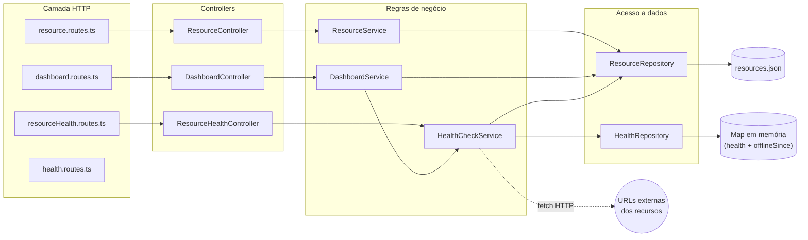
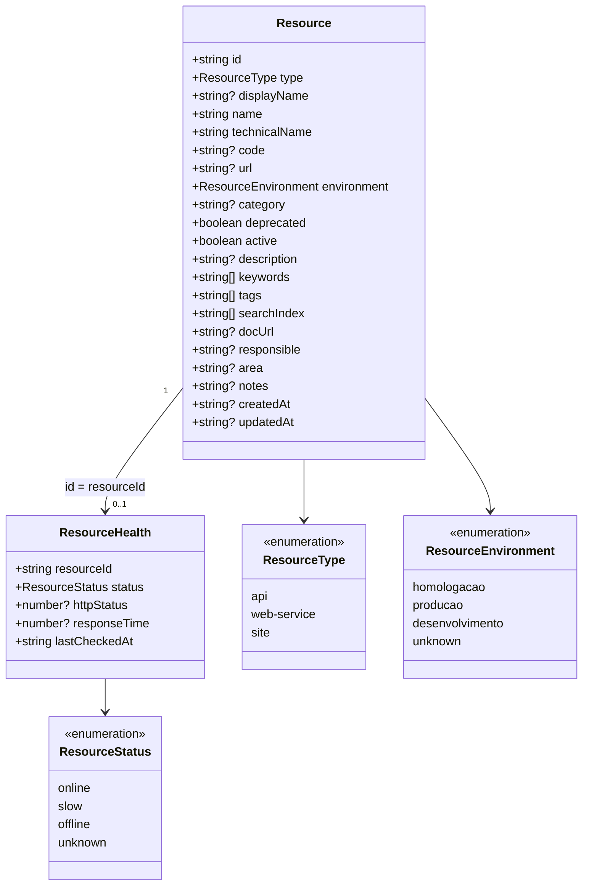
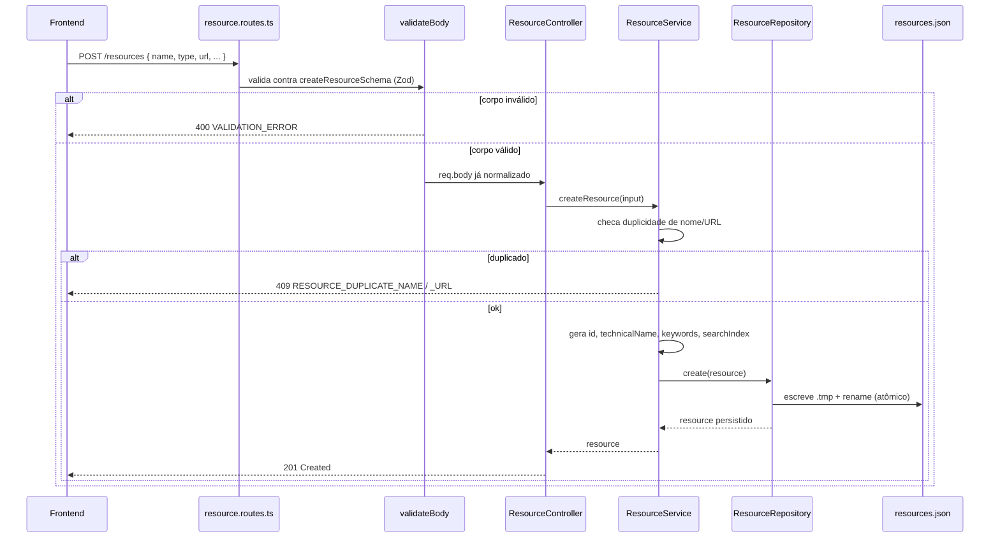
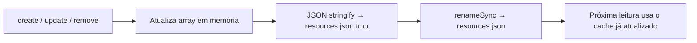

# Buni API Hub — API

API REST em Node.js/Express/TypeScript que centraliza o catálogo de APIs, Web Services e Sites da instituição, expõe um mecanismo de monitoramento de saúde em tempo real e serve os dados consumidos pelo Portal de Serviços (`web/`) e pelo Painel Operacional (`dashboard/`).

> Repositório: `buni-api-hub-api` · Parte do ecossistema **Buni API Hub** (`web/` — Portal de Serviços, `dashboard/` — Painel Operacional, `ingestion/` — importação em lote, ferramenta auxiliar).

---

## Sumário

- [Visão geral](#visão-geral)
- [Objetivo](#objetivo)
- [Arquitetura](#arquitetura)
- [Stack tecnológica](#stack-tecnológica)
- [Estrutura de diretórios](#estrutura-de-diretórios)
- [Modelo de domínio](#modelo-de-domínio)
- [Endpoints](#endpoints)
- [Fluxo da aplicação](#fluxo-da-aplicação)
- [Fluxo dos Dados](#fluxo-dos-dados)
- [Persistência](#persistência)
- [Fluxo de Persistência](#fluxo-de-persistência)
- [Monitoramento de saúde e Painel Operacional](#monitoramento-de-saúde-e-painel-operacional)
- [Tratamento de erros](#tratamento-de-erros)
- [Validação](#validação)
- [Variáveis de ambiente](#variáveis-de-ambiente)
- [Como executar localmente](#como-executar-localmente)
- [Build e deploy](#build-e-deploy)
- [Padrões arquiteturais e boas práticas](#padrões-arquiteturais-e-boas-práticas)
- [Fluxo de desenvolvimento](#fluxo-de-desenvolvimento)
- [Roadmap / melhorias futuras](#roadmap--melhorias-futuras)
- [Licença](#licença)

---

## Visão geral

Esta API é a única porta de entrada para o catálogo de recursos da solução — é o backend que sustenta tanto o Portal de Serviços (`web/`) quanto o Painel Operacional (`dashboard/`), sem que nenhum dos dois se comunique entre si.

**Responsabilidades exclusivas desta API, nenhuma delas compartilhada com outro módulo:**

| Responsabilidade | Por quê é exclusiva desta API |
| --- | --- |
| **Única fonte oficial dos dados** | `api/src/data/resources.json` só existe e só é lido/escrito dentro deste repositório. |
| **Única responsável pela persistência** | `ResourceRepository` é a única classe do sistema com permissão de escrita sobre o catálogo. |
| **Única responsável pelas regras de negócio** | Validação de duplicidade, geração de `id`/`technicalName`/`keywords`/`searchIndex`, timestamps — tudo em `ResourceService`, nunca no frontend. |
| **Única responsável pelo Health Check** | `HealthCheckService` varre as URLs cadastradas de forma autônoma; nenhum frontend dispara ou depende de checagem própria. |
| **Única responsável pelos indicadores do Dashboard** | `DashboardService` agrega catálogo + saúde num payload consolidado; `dashboard/` só exibe o que recebe, sem calcular nada. |

Em todo erro, a API retorna um envelope padronizado (`status`, `code`, `message`) para que nenhum frontend precise interpretar mensagens técnicas.

**A API é totalmente independente da `ingestion/` em tempo de execução.** A fonte oficial de dados é o `ResourceRepository` (`src/repositories/resource.repository.ts`), que lê e escreve exclusivamente em `src/data/resources.json` — o catálogo efetivamente usado pela aplicação. Toda operação de escrita (criar, editar, excluir, alterar status), disparada pelo Portal ou por qualquer outro cliente HTTP, persiste diretamente nesse arquivo através do `ResourceRepository`, cujo conteúdo permanece em cache em memória durante a execução do processo. A `ingestion/` não participa do fluxo operacional da aplicação — é uma ferramenta de importação em lote, executada manualmente e de forma independente (detalhes em [Fluxo dos Dados](#fluxo-dos-dados), [Fluxo de Persistência](#fluxo-de-persistência) e no [README da `ingestion/`](../ingestion/README.md)).

## Objetivo

Eliminar o processo manual de "editar um arquivo, rodar a ingestão, fazer deploy" toda vez que um novo recurso precisa entrar no catálogo, ao mesmo tempo em que fornece uma fonte única e sempre atualizada de status operacional dos serviços — sem depender de o frontend fazer qualquer verificação própria.

## Arquitetura

Arquitetura em camadas (Route → Controller → Service → Repository), sem framework de DI — a composição é feita manualmente em cada arquivo de rota, que instancia e conecta repository → service → controller.



Pontos-chave:

- **Uma única instância de `ResourceRepository`** é criada em `resource.routes.ts` e reexportada — `resourceHealth.routes.ts` e `dashboard.routes.ts` a reaproveitam, evitando caches divergentes do mesmo `resources.json`.
- **`HealthCheckService`** é o único componente que sabe fazer requisições HTTP de verificação; `DashboardService` só lê o resultado já calculado, nunca dispara checagem própria.
- Não há banco de dados. A persistência do catálogo é um arquivo JSON no próprio processo; o resultado do health check vive inteiramente em memória (é perdido a cada restart e repovoado em segundos pelo próximo sweep).

## Stack tecnológica

| Categoria | Tecnologia |
|---|---|
| Runtime | Node.js (ESM puro, `"type": "module"`) |
| Linguagem | TypeScript ~6.0 (`strict: true`) |
| Framework HTTP | Express ^5.2 |
| Validação | Zod ^4.4 |
| CORS | `cors` ^2.8 |
| Execução em dev | `tsx watch` |
| Lint/format | ESLint 10 (flat config) + Prettier 3.9 |
| Empacotamento | `tsc` (compilação direta, sem bundler) |

Não há suíte de testes automatizados configurada (sem Jest/Vitest) — `typecheck` (`tsc --noEmit`) é a única verificação estática além do lint.

## Estrutura de diretórios

```
api/
├── src/
│   ├── config/
│   │   └── env.ts                  # validação Zod das env vars
│   ├── controllers/
│   │   ├── dashboard.controller.ts
│   │   ├── health.controller.ts
│   │   ├── resource.controller.ts
│   │   └── resourceHealth.controller.ts
│   ├── services/
│   │   ├── dashboard.service.ts
│   │   ├── healthCheck.service.ts
│   │   └── resource.service.ts
│   ├── repositories/
│   │   ├── health.repository.ts
│   │   └── resource.repository.ts
│   ├── routes/
│   │   ├── dashboard.routes.ts
│   │   ├── health.routes.ts
│   │   ├── index.ts                # agrega todas as rotas
│   │   ├── resource.routes.ts
│   │   └── resourceHealth.routes.ts
│   ├── middleware/
│   │   ├── errorHandler.ts
│   │   ├── notFoundHandler.ts
│   │   └── validateBody.ts
│   ├── validators/
│   │   └── resource.schema.ts      # schemas Zod de criação/edição
│   ├── models/
│   │   └── resource.model.ts       # Resource, ResourceHealth e tipos relacionados
│   ├── types/
│   │   ├── dashboard.type.ts
│   │   └── resourceSummary.type.ts
│   ├── utils/
│   │   ├── ApiError.ts
│   │   ├── generateKeywordsAndIndex.ts
│   │   ├── normalizeSearchTerm.ts
│   │   ├── promisePool.ts          # runWithConcurrency (pool de workers)
│   │   └── slugify.ts
│   ├── data/
│   │   └── resources.json          # catálogo oficial — única fonte de dados da aplicação, gerenciada pelo ResourceRepository
│   ├── app.ts                      # composição do Express (middlewares + rotas)
│   └── server.ts                   # bootstrap: agenda o sweep e sobe o servidor
├── scripts/
│   └── copy-data.mjs               # copia resources.json para dist/ no build
├── docs/
│   └── dashboard-operacional.md    # monitoramento e Painel Operacional, documentação completa
├── .env.example
├── eslint.config.js
├── tsconfig.json
└── package.json
```

## Modelo de domínio

`src/models/resource.model.ts` é a fonte de verdade — espelhada manualmente em `ingestion/src/types.ts`, `web/src/features/catalog/types.ts` e `dashboard/src/types/index.ts` (os quatro projetos são Node independentes, sem pacote compartilhado).



Os campos `docUrl`, `responsible`, `area`, `notes`, `createdAt`, `updatedAt` são metadados do cadastro manual via API/Portal — não existem nos registros importados em lote pela `ingestion/`, por isso são todos opcionais.

## Endpoints

Todas as respostas são JSON. Não há autenticação/autorização implementada (ver [Roadmap](#roadmap--melhorias-futuras)).

### Catálogo (`resource.routes.ts`)

| Método | Rota | Descrição | Status de sucesso |
|---|---|---|---|
| `GET` | `/resources` | Lista o catálogo. Aceita `?type=`, `?environment=`, `?search=` | 200 |
| `GET` | `/resources/:id` | Um recurso específico | 200 / 404 |
| `GET` | `/summary` | Contagem por tipo (`total`, `apis`, `webServices`, `sites`) | 200 |
| `POST` | `/resources` | Cria um recurso (`createResourceSchema`) | 201 / 400 / 409 |
| `PUT` | `/resources/:id` | Atualiza parcialmente (`updateResourceSchema`) | 200 / 400 / 404 / 409 |
| `DELETE` | `/resources/:id` | Remove um recurso | 204 / 404 |

### Saúde (`resourceHealth.routes.ts` / `health.routes.ts`)

| Método | Rota | Descrição |
|---|---|---|
| `GET` | `/health` | Liveness do processo — `{ status: 'UP' }` |
| `GET` | `/health/resources` | Último status conhecido de todos os recursos |
| `GET` | `/health/resources/:id` | Status de um recurso (`unknown` se ainda não varrido) |

### Painel Operacional (`dashboard.routes.ts`)

| Método | Rota | Descrição |
|---|---|---|
| `GET` | `/dashboard` | `{ summary, incidents }` combinados — usado pelo Painel |
| `GET` | `/dashboard/summary` | Só o resumo consolidado |
| `GET` | `/dashboard/incidents` | Só a lista de recursos que exigem atenção |

### Raiz

| Método | Rota | Descrição |
|---|---|---|
| `GET` | `/` | Metadados da API (`name`, `status`, `version`, `timestamp`) |

## Fluxo da aplicação

Requisição típica de escrita (`POST /resources`), mostrando as camadas envolvidas:



## Fluxo dos Dados

Todo cadastro, edição, exclusão ou alteração de status feito pelo Portal de Serviços segue sempre o mesmo caminho, de ponta a ponta, sem atalhos e sem depender de nenhum processo externo:

```
Portal de Serviços
        │
        ▼
REST API
        │
        ▼
ResourceService
        │
        ▼
ResourceRepository
        │
        ▼
api/src/data/resources.json
```

1. O usuário realiza uma ação no Portal (ex.: salvar um novo recurso no formulário de Cadastro).
2. O Frontend envia a requisição HTTP correspondente (`POST`/`PUT`/`DELETE /resources`) para a REST API.
3. A rota valida o corpo da requisição e delega para o `ResourceController`, que por sua vez chama o `ResourceService`.
4. O `ResourceService` aplica as regras de negócio (checagem de duplicidade, geração de `id`/`technicalName`/`keywords`/`searchIndex`, timestamps) e chama o `ResourceRepository`.
5. O `ResourceRepository` atualiza o array em cache (memória) e grava o resultado em `api/src/data/resources.json` de forma atômica (`.tmp` + `rename`).
6. A partir desse momento, qualquer leitura (catálogo do Portal, Painel Operacional, health check) reflete o dado já persistido, servido diretamente do cache em memória do `ResourceRepository` — sem reler o disco a cada requisição.

Esse é o **único** fluxo de escrita existente na aplicação. A `ingestion/` não faz parte dele: ela roda separadamente, sob demanda, e só afeta `api/src/data/resources.json` se alguém copiar manualmente o arquivo que ela gera (ver [README da `ingestion/`](../ingestion/README.md)).

## Persistência

`ResourceRepository` (`src/repositories/resource.repository.ts`) é a **única** camada que conhece o arquivo `src/data/resources.json`.

- Leitura *lazy*: o arquivo é lido uma vez (`readFileSync`) na primeira chamada e mantido em cache em memória — não há I/O de disco nas leituras seguintes.
- Escrita atômica: toda mutação (`create`/`update`/`remove`) grava em `resources.json.tmp` e depois faz `renameSync` para o arquivo final, evitando corromper o catálogo se o processo for interrompido no meio da escrita.
- Não há banco de dados. Esta é uma decisão deliberada da sprint atual — ver [Roadmap](#roadmap--melhorias-futuras) para a migração planejada.



## Fluxo de Persistência

As quatro operações de escrita da aplicação passam exatamente pelo mesmo caminho (Route → `validateBody` → Controller → Service → Repository → disco) — o que muda entre elas é só o método HTTP e a validação aplicada.

### Criação

`POST /resources` → `validateBody(createResourceSchema)` → `ResourceController.create` → `ResourceService.createResource`:

1. Valida duplicidade de `name`/`url` (case-insensitive, trim) contra `repository.findAll()` — se houver, `409 RESOURCE_DUPLICATE_NAME`/`_URL`.
2. Gera `id`, `technicalName`, `keywords`, `searchIndex` e `createdAt`/`updatedAt`.
3. Chama `ResourceRepository.create()`, que adiciona ao array em cache e persiste (`.tmp` + `rename`).
4. Resposta `201 Created` com o recurso já persistido.

### Edição

`PUT /resources/:id` → `validateBody(updateResourceSchema)` → `ResourceController.update` → `ResourceService.updateResource`:

1. Busca o recurso existente — `404 RESOURCE_NOT_FOUND` se não existir.
2. Revalida duplicidade de `name`/`url`, excluindo o próprio `id` da checagem.
3. Recalcula `searchIndex`/`keywords` se `name`, `description` ou `keywords` mudaram; atualiza `updatedAt`.
4. Chama `ResourceRepository.update()`, que substitui o registro no array em cache e persiste.

### Exclusão

`DELETE /resources/:id` → `ResourceController.remove` → `ResourceService.deleteResource`:

1. Busca o recurso — `404 RESOURCE_NOT_FOUND` se não existir.
2. Chama `ResourceRepository.remove()`, que retira o registro do array em cache e persiste.
3. Resposta `204 No Content`.

### Alteração de status

**Não é uma operação separada.** Ativar/desativar um recurso é uma edição comum — `PUT /resources/:id` com o campo `active` no corpo — e segue exatamente o fluxo de **Edição** acima. `DashboardService.resolveStatus()` usa esse campo (`active: false` → status `maintenance`, independentemente do resultado do Health Check) para decidir o status consolidado exibido no Painel Operacional.

Em nenhum dos quatro casos existe um caminho alternativo de escrita: `HealthCheckService` e `DashboardService` só leem o estado já persistido, nunca o alteram.

## Monitoramento de saúde e Painel Operacional

`HealthCheckService` roda de forma totalmente autônoma no backend — o frontend nunca dispara nem depende de uma checagem própria. Um sweep varre todas as URLs cadastradas (disparo imediato no boot + `setInterval` a cada `HEALTH_CHECK_INTERVAL_MS`), classifica cada recurso (`online`/`slow`/`offline`/`unknown`) e grava o resultado em memória (`HealthRepository`). `DashboardService` agrega esse resultado com o campo `active` de cada recurso numa visão consolidada de 4 status (`online`/`offline`/`maintenance`/`unknown`), servida pelos endpoints `/dashboard*`.

Documentação completa — agendamento, concorrência, tabela de classificação de status (os dois níveis: HTTP bruto e consolidado do Painel), fluxo Backend → Frontend, casos de uso, cenários de teste e limitações conhecidas — está em **[`docs/dashboard-operacional.md`](docs/dashboard-operacional.md)**.

## Tratamento de erros

Todo erro de negócio é lançado como `ApiError` (`src/utils/ApiError.ts`) e convertido pelo `errorHandler` (último middleware da cadeia) num envelope único:

```json
{
  "status": 409,
  "code": "RESOURCE_DUPLICATE_URL",
  "message": "Já existe um recurso cadastrado utilizando esta URL."
}
```

| Factory | Status | `code` padrão |
|---|---|---|
| `ApiError.badRequest(msg, code?)` | 400 | `VALIDATION_ERROR` |
| `ApiError.notFound(msg, code?)` | 404 | `RESOURCE_NOT_FOUND` |
| `ApiError.conflict(msg, code?)` | 409 | `RESOURCE_CONFLICT` |
| `ApiError.unprocessable(msg, code?)` | 422 | `BUSINESS_RULE_ERROR` |

`code`s efetivamente emitidos hoje: `VALIDATION_ERROR`, `RESOURCE_NOT_FOUND`, `RESOURCE_DUPLICATE_NAME`, `RESOURCE_DUPLICATE_URL`, `ROUTE_NOT_FOUND` (rota inexistente), `INTERNAL_ERROR` (qualquer erro não tratado, logado no console e nunca exposto ao cliente). `RESOURCE_CONFLICT` e `BUSINESS_RULE_ERROR` existem como defaults das factories mas não são emitidos por nenhuma regra atual — **Planejado** para uso em futuras regras de negócio mais específicas.

## Validação

`validateBody` (middleware) roda o corpo da requisição contra um schema Zod (`validators/resource.schema.ts`) antes do controller. `createResourceSchema` exige `name`, `type`, `url` (validada como URL) e `environment`; `updateResourceSchema` é o mesmo schema com todos os campos opcionais (`.partial()`), permitindo PATCH parcial via `PUT`.

## Variáveis de ambiente

| Variável | Obrigatória | Default (schema) | Descrição |
|---|---|---|---|
| `PORT` | Não | `3333` | Porta HTTP do servidor |
| `HEALTH_CHECK_INTERVAL_MS` | Não | `30000` | Intervalo entre sweeps de health check |
| `HEALTH_CHECK_TIMEOUT_MS` | Não | `5000` | Timeout por requisição de verificação |
| `HEALTH_CHECK_SLOW_THRESHOLD_MS` | Não | `1000` | Acima disso, um recurso saudável é classificado `slow` |
| `HEALTH_CHECK_CONCURRENCY` | Não | `20` | Nº máximo de checagens HTTP simultâneas |

O `.env.example` do repositório define `HEALTH_CHECK_INTERVAL_MS=60000` — ou seja, o valor efetivo em desenvolvimento local (60s) é mais conservador que o default embutido no código (30s), que só vale se a variável estiver totalmente ausente. Validação via Zod em `config/env.ts`; se qualquer variável definida for inválida, o processo falha no boot com uma mensagem detalhada (fail-fast, não silencioso).

## Como executar localmente

Pré-requisitos: Node.js compatível com ESM/TypeScript 6, npm.

```bash
cd api
cp .env.example .env      # ajuste os valores se necessário
npm install
npm run dev                # tsx watch — recarrega a cada mudança
```

O servidor sobe em `http://localhost:3333` (ou o valor de `PORT`), executa o sweep inicial de health check imediatamente e depois periodicamente.

Outros scripts:

```bash
npm run typecheck   # tsc --noEmit
npm run lint         # eslint .
npm run lint:fix
npm run format       # prettier --write .
```

Não há suíte de testes automatizados nesta sprint.

## Build e deploy

```bash
npm run build   # tsc (compila src/ → dist/) + copy-data.mjs (copia resources.json)
npm run start    # node dist/server.js
```

`scripts/copy-data.mjs` é necessário porque `tsc` só compila arquivos `.ts` — sem essa etapa, `dist/data/resources.json` não existiria e o `ResourceRepository` falharia ao subir em produção.

Não há pipeline de CI/CD, Dockerfile ou script de deploy versionado neste repositório. O artefato de build (`dist/`) é um processo Node.js comum, executável em qualquer ambiente com Node instalado (`node dist/server.js`), atrás de um `PORT` configurável — compatível com plataformas como Render, Railway ou um container próprio, mas a configuração específica da hospedagem está fora deste repositório.

## Padrões arquiteturais e boas práticas

- **Separação em camadas** (Route → Controller → Service → Repository) com responsabilidade única por camada: controllers só traduzem HTTP↔domínio, services concentram regra de negócio e nunca conhecem Express, repositories são o único ponto de acesso a dados.
- **Repository Pattern** isolando toda a lógica de leitura/escrita do `resources.json`, preparando o terreno para trocar a persistência por um banco de dados sem tocar em service/controller/route.
- **Injeção de dependência manual** via construtor (`new ResourceService(resourceRepository)`), sem container de DI — simples e suficiente para o tamanho atual do projeto.
- **Fail-fast de configuração**: env vars inválidas derrubam o processo no boot, nunca falham silenciosamente em runtime.
- **Envelope de erro único e estável** (`status`/`code`/`message`), permitindo que o frontend trate qualquer erro de forma genérica.
- **Escrita atômica em disco** (tmp + rename) para nunca deixar o catálogo num estado corrompido.
- **Tipagem forte de ponta a ponta** (TypeScript `strict`, schemas Zod inferindo tipos via `z.infer`).

## Fluxo de desenvolvimento

1. Alterações de schema de dados começam em `models/resource.model.ts` — e precisam ser replicadas manualmente em `ingestion/src/types.ts`, `web/src/features/catalog/types.ts` e `dashboard/src/types/index.ts`.
2. Nova regra de negócio → `services/`; nova validação de entrada → `validators/` + `middleware/validateBody.ts`.
3. `npm run typecheck && npm run lint` antes de qualquer commit.
4. Não há testes automatizados — validação manual via `npm run dev` + requisições HTTP (curl/Postman) é o processo atual.

## Roadmap / melhorias futuras

> Itens listados aqui **não estão implementados** — documentados para transparência sobre a direção do projeto, não como funcionalidade existente.

- **Persistência em banco de dados** — a arquitetura em camadas (Repository Pattern) já isola o suficiente para essa migração não exigir mudanças em service/controller.
- **Autenticação e autorização** — hoje todos os endpoints são públicos.
- **Testes automatizados** (unitários para services/utils, integração para rotas).
- **Uso efetivo dos `code`s `RESOURCE_CONFLICT` e `BUSINESS_RULE_ERROR`** em novas regras de negócio.
- **Automatizar a cópia do catálogo gerado por `ingestion/`** para `src/data/resources.json` (hoje é um passo manual, ver README de `ingestion/`).
- **Pipeline de CI/CD** (build, typecheck, lint, deploy automatizados).

Melhorias específicas do monitoramento (Health Check / Painel Operacional) estão priorizadas em [`docs/dashboard-operacional.md`](docs/dashboard-operacional.md#melhorias-futuras), não repetidas aqui.

## Licença

Não há arquivo de licença (`LICENSE`) neste repositório. Projeto proprietário/interno — uso restrito à organização, salvo indicação contrária de quem administra o repositório.
