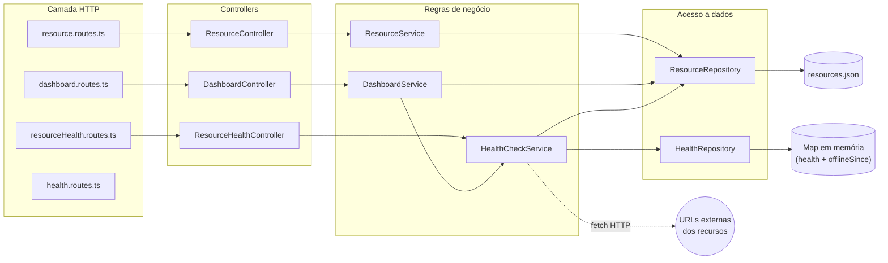
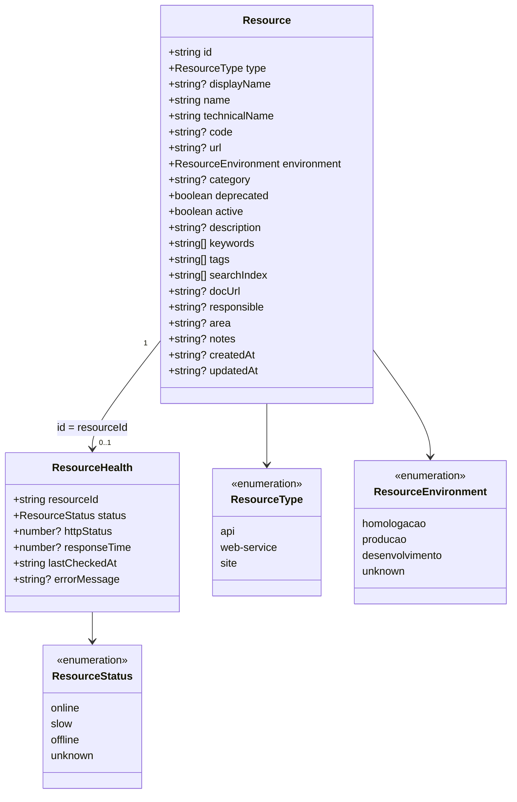
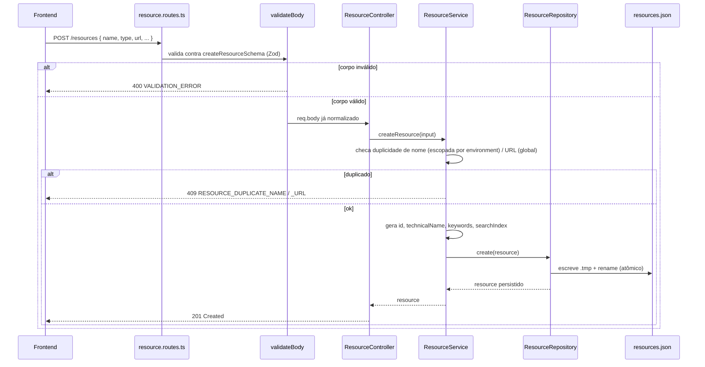
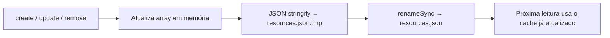
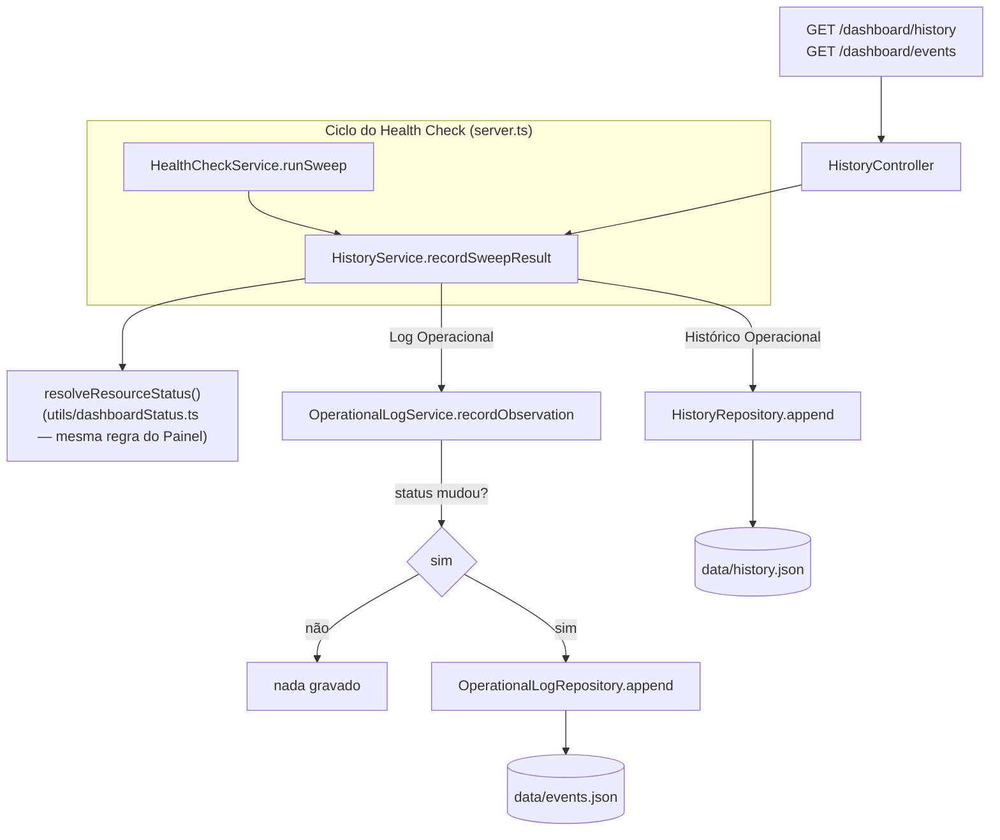

# Buni API Hub — API

API REST em Node.js/Express/TypeScript que centraliza o catálogo de APIs, Web Services e Sites da instituição, expõe um mecanismo de monitoramento de saúde em tempo real e serve os dados consumidos pelo Portal de Serviços (`web/`) e pelo Painel Operacional (`dashboard/`).

> Repositório: `buni-api-hub-api` · Parte do ecossistema **Buni API Hub** (`web/` — Portal de Serviços, `dashboard/` — Painel Operacional, `ingestion/` — importação em lote, ferramenta auxiliar).

---

## Sumário

- [Visão geral](#visão-geral)
- [Objetivo](#objetivo)
- [Arquitetura](#arquitetura)
- [Stack tecnológica](#stack-tecnológica)
- [Estrutura de diretórios](#estrutura-de-diretórios)
- [Modelo de domínio](#modelo-de-domínio)
- [Endpoints](#endpoints)
- [Fluxo de Funcionamento](#fluxo-de-funcionamento)
- [Fluxo da aplicação](#fluxo-da-aplicação)
- [Fluxo dos Dados](#fluxo-dos-dados)
- [Persistência](#persistência)
- [Fluxo de Persistência](#fluxo-de-persistência)
  - [Consistência ambiente × URL](#consistência-ambiente--url)
- [Monitoramento de saúde e Painel Operacional](#monitoramento-de-saúde-e-painel-operacional)
- [Histórico Operacional e Log Operacional](#histórico-operacional-e-log-operacional)
- [Tratamento de erros](#tratamento-de-erros)
- [Validação](#validação)
- [Variáveis de ambiente](#variáveis-de-ambiente)
- [Como executar localmente](#como-executar-localmente)
- [Build e deploy](#build-e-deploy)
- [Padrões arquiteturais e boas práticas](#padrões-arquiteturais-e-boas-práticas)
- [Fluxo de desenvolvimento](#fluxo-de-desenvolvimento)
- [Roadmap / melhorias futuras](#roadmap--melhorias-futuras)
- [Licença](#licença)

---

## Visão geral

Esta API é a única porta de entrada para o catálogo de recursos da solução — é o backend que sustenta tanto o Portal de Serviços (`web/`) quanto o Painel Operacional (`dashboard/`), sem que nenhum dos dois se comunique entre si.

**Responsabilidades exclusivas desta API, nenhuma delas compartilhada com outro módulo:**

| Responsabilidade | Por quê é exclusiva desta API |
| --- | --- |
| **Única fonte oficial dos dados** | `api/src/data/resources.json` só existe e só é lido/escrito dentro deste repositório. |
| **Única responsável pela persistência** | `ResourceRepository` é a única classe do sistema com permissão de escrita sobre o catálogo. |
| **Única responsável pelas regras de negócio** | Validação de duplicidade, geração de `id`/`technicalName`/`keywords`/`searchIndex`, timestamps — tudo em `ResourceService`, nunca no frontend. |
| **Única responsável pelo Health Check** | `HealthCheckService` varre as URLs cadastradas de forma autônoma; nenhum frontend dispara ou depende de checagem própria. |
| **Única responsável pelos indicadores do Dashboard** | `DashboardService` agrega catálogo + saúde num payload consolidado; `dashboard/` só exibe o que recebe, sem calcular nada. |

Em todo erro, a API retorna um envelope padronizado (`status`, `code`, `message`) para que nenhum frontend precise interpretar mensagens técnicas.

**A API é totalmente independente da `ingestion/` em tempo de execução.** A fonte oficial de dados é o `ResourceRepository` (`src/repositories/resource.repository.ts`), que lê e escreve exclusivamente em `src/data/resources.json` — o catálogo efetivamente usado pela aplicação. Toda operação de escrita (criar, editar, excluir, alterar status), disparada pelo Portal ou por qualquer outro cliente HTTP, persiste diretamente nesse arquivo através do `ResourceRepository`, cujo conteúdo permanece em cache em memória durante a execução do processo. A `ingestion/` não participa do fluxo operacional da aplicação — é uma ferramenta de importação em lote, executada manualmente e de forma independente (detalhes em [Fluxo dos Dados](#fluxo-dos-dados), [Fluxo de Persistência](#fluxo-de-persistência) e no [README da `ingestion/`](../ingestion/README.md)).

## Objetivo

Eliminar o processo manual de "editar um arquivo, rodar a ingestão, fazer deploy" toda vez que um novo recurso precisa entrar no catálogo, ao mesmo tempo em que fornece uma fonte única e sempre atualizada de status operacional dos serviços — sem depender de o frontend fazer qualquer verificação própria.

## Arquitetura

Arquitetura em camadas (Route → Controller → Service → Repository), sem framework de DI — a composição é feita manualmente em cada arquivo de rota, que instancia e conecta repository → service → controller.



Pontos-chave:

- **Uma única instância de `ResourceRepository`** é criada em `resource.routes.ts` e reexportada — `resourceHealth.routes.ts` e `dashboard.routes.ts` a reaproveitam, evitando caches divergentes do mesmo `resources.json`.
- **`HealthCheckService`** é o único componente que sabe fazer requisições HTTP de verificação; `DashboardService` só lê o resultado já calculado, nunca dispara checagem própria.
- Não há banco de dados. A persistência do catálogo é um arquivo JSON no próprio processo; o resultado do health check vive inteiramente em memória (é perdido a cada restart e repovoado em segundos pelo próximo sweep).

## Stack tecnológica

| Categoria | Tecnologia |
|---|---|
| Runtime | Node.js (ESM puro, `"type": "module"`) |
| Linguagem | TypeScript ~6.0 (`strict: true`) |
| Framework HTTP | Express ^5.2 |
| Validação | Zod ^4.4 |
| CORS | `cors` ^2.8 |
| Execução em dev | `tsx watch` |
| Lint/format | ESLint 10 (flat config) + Prettier 3.9 |
| Empacotamento | `tsc` (compilação direta, sem bundler) |

Não há suíte de testes automatizados configurada (sem Jest/Vitest) — `typecheck` (`tsc --noEmit`) é a única verificação estática além do lint.

## Estrutura de diretórios

```
api/
├── src/
│   ├── config/
│   │   └── env.ts                  # validação Zod das env vars
│   ├── controllers/
│   │   ├── dashboard.controller.ts
│   │   ├── health.controller.ts
│   │   ├── history.controller.ts   # Histórico Operacional (snapshots) + Log Operacional (eventos)
│   │   ├── resource.controller.ts
│   │   └── resourceHealth.controller.ts
│   ├── services/
│   │   ├── dashboard.service.ts
│   │   ├── healthCheck.service.ts
│   │   ├── history.service.ts        # orquestra Histórico Operacional (snapshot) + Log Operacional (eventos) por sweep
│   │   ├── operationalLog.service.ts # Log Operacional — detecção de transição de status
│   │   └── resource.service.ts
│   ├── repositories/
│   │   ├── health.repository.ts
│   │   ├── history.repository.ts       # JsonHistoryRepository (implementa HistoryRepository) — Histórico Operacional
│   │   ├── operationalLog.repository.ts # JsonOperationalLogRepository (implementa OperationalLogRepository) — Log Operacional
│   │   └── resource.repository.ts
│   ├── routes/
│   │   ├── dashboard.routes.ts
│   │   ├── health.routes.ts
│   │   ├── history.routes.ts       # GET /dashboard/history, GET /dashboard/events
│   │   ├── index.ts                # agrega todas as rotas
│   │   ├── resource.routes.ts
│   │   └── resourceHealth.routes.ts
│   ├── middleware/
│   │   ├── errorHandler.ts
│   │   ├── notFoundHandler.ts
│   │   └── validateBody.ts
│   ├── validators/
│   │   └── resource.schema.ts      # schemas Zod de criação/edição
│   ├── models/
│   │   ├── history.model.ts         # HistorySnapshot + interface HistoryRepository — Histórico Operacional
│   │   ├── operationalLog.model.ts  # OperationalEvent + interface OperationalLogRepository — Log Operacional
│   │   └── resource.model.ts        # Resource, ResourceHealth e tipos relacionados
│   ├── types/
│   │   ├── dashboard.type.ts
│   │   └── resourceSummary.type.ts
│   ├── utils/
│   │   ├── ApiError.ts
│   │   ├── dashboardStatus.ts      # resolveResourceStatus/calculateAvailabilityPercentage (compartilhado)
│   │   ├── generateKeywordsAndIndex.ts
│   │   ├── normalizeSearchTerm.ts
│   │   ├── promisePool.ts          # runWithConcurrency (pool de workers)
│   │   ├── resolveResourceEnvironment.ts # URL → homologacao|producao|unknown (domínios oficiais)
│   │   └── slugify.ts
│   ├── data/
│   │   ├── events.json             # gerado em runtime — Log Operacional (eventos)
│   │   ├── history.json            # gerado em runtime — Histórico Operacional (snapshots)
│   │   └── resources.json          # catálogo oficial — única fonte de dados da aplicação, gerenciada pelo ResourceRepository
│   ├── app.ts                      # composição do Express (middlewares + rotas)
│   └── server.ts                   # bootstrap: agenda o sweep e sobe o servidor
├── scripts/
│   └── copy-data.mjs               # copia resources.json para dist/ no build
├── docs/
│   └── dashboard-operacional.md    # monitoramento e Painel Operacional, documentação completa
├── .env.example
├── eslint.config.js
├── tsconfig.json
└── package.json
```

## Modelo de domínio

`src/models/resource.model.ts` é a fonte de verdade — espelhada manualmente em `ingestion/src/types.ts`, `web/src/features/catalog/types.ts` e `dashboard/src/types/index.ts` (os quatro projetos são Node independentes, sem pacote compartilhado).



Os campos `docUrl`, `responsible`, `area`, `notes`, `createdAt`, `updatedAt` são metadados do cadastro manual via API/Portal — não existem nos registros importados em lote pela `ingestion/`, por isso são todos opcionais.

## Endpoints

Todas as respostas são JSON. Não há autenticação/autorização implementada (ver [Roadmap](#roadmap--melhorias-futuras)).

### Catálogo (`resource.routes.ts`)

| Método | Rota | Descrição | Status de sucesso |
|---|---|---|---|
| `GET` | `/resources` | Lista o catálogo. Aceita `?type=`, `?environment=`, `?search=` | 200 |
| `GET` | `/resources/:id` | Um recurso específico | 200 / 404 |
| `GET` | `/summary` | Contagem por tipo (`total`, `apis`, `webServices`, `sites`) | 200 |
| `POST` | `/resources` | Cria um recurso (`createResourceSchema`) | 201 / 400 / 409 |
| `PUT` | `/resources/:id` | Atualiza parcialmente (`updateResourceSchema`) | 200 / 400 / 404 / 409 |
| `DELETE` | `/resources/:id` | Remove um recurso | 204 / 404 |

### Administração (`resourcePromotion.routes.ts`)

| Método | Rota | Descrição | Status de sucesso |
|---|---|---|---|
| `POST` | `/admin/resources/promote-to-producao` | Promove em lote todos os recursos de Homologação para Produção (idempotente, ver [Promoção em lote](#promoção-em-lote-homologação--produção)) | 200 / 422 |

### Saúde (`resourceHealth.routes.ts` / `health.routes.ts`)

| Método | Rota | Descrição |
|---|---|---|
| `GET` | `/health` | Liveness do processo — `{ status: 'UP' }` |
| `GET` | `/health/resources` | Último status conhecido de todos os recursos |
| `GET` | `/health/resources/:id` | Status de um recurso (`unknown` se ainda não varrido) |

### Painel Operacional (`dashboard.routes.ts`)

| Método | Rota | Descrição |
|---|---|---|
| `GET` | `/dashboard` | `{ summary, incidents }` combinados — usado pelo Painel |
| `GET` | `/dashboard/summary` | Só o resumo consolidado |
| `GET` | `/dashboard/incidents` | Só a lista de recursos que exigem atenção |

### Histórico Operacional e Log Operacional (`history.routes.ts`)

| Método | Rota | Descrição |
|---|---|---|
| `GET` | `/dashboard/history` | Snapshots agregados do ambiente, um por sweep (até 2000 mais recentes) |
| `GET` | `/dashboard/events` | Transições reais de status por recurso, mais recente primeiro. Filtros opcionais via query string: `resourceId`, `status` (`online`\|`offline`\|`maintenance`\|`unknown`), `environment`, `since`/`until` (ISO 8601, sobre `timestamp`) — todos combináveis; valor inválido é ignorado (mesmo comportamento de `GET /resources`) |

### Raiz

| Método | Rota | Descrição |
|---|---|---|
| `GET` | `/` | Metadados da API (`name`, `status`, `version`, `timestamp`) |

## Fluxo de Funcionamento

Sequência real de inicialização (`src/server.ts`), do processo subindo até o primeiro dado disponível para os frontends:

```
Inicialização do processo
        │
        ▼
Validação das variáveis de ambiente (config/env.ts, Zod)
        │  falha aqui derruba o processo (fail-fast)
        ▼
Composição do Express (app.ts: cors, json, rotas, error handlers)
        │
        ▼
Carregamento do catálogo (resources.json → ResourceRepository, leitura lazy no primeiro acesso)
        │
        ▼
Sweep inicial do Health Check (disparado imediatamente, antes de o servidor aceitar requisições)
        │
        ├─▶ Verificação HTTP de cada recurso cadastrado (HealthCheckService, concorrência limitada)
        ├─▶ Classificação de status (online/slow/offline/unknown) → HealthRepository (memória)
        ├─▶ Snapshot agregado do ambiente → Histórico Operacional (history.json)
        └─▶ Transições de status por recurso → Log Operacional (events.json), só quando muda
        │
        ▼
app.listen(PORT) — servidor aceita requisições HTTP
        │
        ▼
setInterval a cada HEALTH_CHECK_INTERVAL_MS — repete o sweep indefinidamente
        │
        ▼
Consumo pelos frontends: GET /resources, /dashboard*, /health* (web/, dashboard/) — sempre leitura do estado já calculado, nunca uma checagem sob demanda
```

1. **Inicialização da API** — `server.ts` importa `config/env.ts`; a validação Zod roda na importação do módulo, antes de qualquer outra coisa. Uma env var inválida lança exceção e encerra o processo imediatamente (fail-fast, nunca falha silenciosa em runtime).
2. **Composição do Express** — `app.ts` monta `cors`, `express.json`, todas as rotas (`routes/index.ts`) e os middlewares finais (`notFoundHandler`, `errorHandler`).
3. **Carregamento dos recursos** — não é um passo explícito de boot: `ResourceRepository` lê `resources.json` de forma *lazy*, na primeira chamada a `findAll()`/`findById()`. Na prática, isso acontece já no sweep inicial (próximo passo), então o catálogo está em memória antes do servidor aceitar a primeira requisição HTTP.
4. **Processo de monitoramento** — `runSweepAndRecordHistory()` roda uma vez imediatamente e depois a cada `HEALTH_CHECK_INTERVAL_MS` (`setInterval`), chamando `HealthCheckService.runSweep()`.
5. **Atualização dos status** — cada recurso é verificado via HTTP (`fetch`, timeout e concorrência configuráveis); o resultado (`online`/`slow`/`offline`/`unknown`, `httpStatus`, `responseTime`, `errorMessage` quando aplicável) fica em `HealthRepository`, só em memória.
6. **Registro do Histórico Operacional** — depois que o sweep termina, `HistoryService.recordSweepResult()` grava sempre um `HistorySnapshot` agregado do ambiente inteiro.
7. **Persistência** — o mesmo `recordSweepResult()` delega ao `OperationalLogService` a detecção de transições por recurso: só quando o status de um recurso muda é que um evento é gravado no Log Operacional. Snapshot e evento (quando existe) são persistidos de forma atômica (`.tmp` + `rename`) em `history.json`/`events.json`, respectivamente.
8. **Consumo pelo Dashboard** — `dashboard/` (via `GET /dashboard` e `GET /dashboard/history`) e `web/` (via `GET /dashboard/events`) só leem o que já foi calculado e persistido nos passos acima; nenhum dos dois frontends dispara uma verificação própria.

## Fluxo da aplicação

Requisição típica de escrita (`POST /resources`), mostrando as camadas envolvidas:



## Fluxo dos Dados

Todo cadastro, edição, exclusão ou alteração de status feito pelo Portal de Serviços segue sempre o mesmo caminho, de ponta a ponta, sem atalhos e sem depender de nenhum processo externo:

```
Portal de Serviços
        │
        ▼
REST API
        │
        ▼
ResourceService
        │
        ▼
ResourceRepository
        │
        ▼
api/src/data/resources.json
```

1. O usuário realiza uma ação no Portal (ex.: salvar um novo recurso no formulário de Cadastro).
2. O Frontend envia a requisição HTTP correspondente (`POST`/`PUT`/`DELETE /resources`) para a REST API.
3. A rota valida o corpo da requisição e delega para o `ResourceController`, que por sua vez chama o `ResourceService`.
4. O `ResourceService` aplica as regras de negócio (checagem de duplicidade, geração de `id`/`technicalName`/`keywords`/`searchIndex`, timestamps) e chama o `ResourceRepository`.
5. O `ResourceRepository` atualiza o array em cache (memória) e grava o resultado em `api/src/data/resources.json` de forma atômica (`.tmp` + `rename`).
6. A partir desse momento, qualquer leitura (catálogo do Portal, Painel Operacional, health check) reflete o dado já persistido, servido diretamente do cache em memória do `ResourceRepository` — sem reler o disco a cada requisição.

Esse é o **único** fluxo de escrita existente na aplicação. A `ingestion/` não faz parte dele: ela roda separadamente, sob demanda, e só afeta `api/src/data/resources.json` se alguém copiar manualmente o arquivo que ela gera (ver [README da `ingestion/`](../ingestion/README.md)).

## Persistência

`ResourceRepository` (`src/repositories/resource.repository.ts`) é a **única** camada que conhece o arquivo `src/data/resources.json`.

- Leitura *lazy*: o arquivo é lido uma vez (`readFileSync`) na primeira chamada e mantido em cache em memória — não há I/O de disco nas leituras seguintes.
- Escrita atômica: toda mutação (`create`/`update`/`remove`) grava em `resources.json.tmp` e depois faz `renameSync` para o arquivo final, evitando corromper o catálogo se o processo for interrompido no meio da escrita.
- Não há banco de dados. Esta é uma decisão deliberada da sprint atual — ver [Roadmap](#roadmap--melhorias-futuras) para a migração planejada.



## Fluxo de Persistência

As quatro operações de escrita da aplicação passam exatamente pelo mesmo caminho (Route → `validateBody` → Controller → Service → Repository → disco) — o que muda entre elas é só o método HTTP e a validação aplicada.

### Criação

`POST /resources` → `validateBody(createResourceSchema)` → `ResourceController.create` → `ResourceService.createResource`:

1. Valida duplicidade de `name` (escopada por `environment` — ver [Unicidade de nome por ambiente](#unicidade-de-nome-por-ambiente)) e de `url` (case-insensitive, trim, **global**) contra `repository.findAll()` — se houver, `409 RESOURCE_DUPLICATE_NAME`/`_URL`.
2. Valida consistência entre `environment` e `url` — se houver, `422 RESOURCE_ENVIRONMENT_MISMATCH` (ver [Consistência ambiente × URL](#consistência-ambiente--url) abaixo).
3. Gera `id` (`${type}-${environment}-${slug(technicalName)}`, ver [Geração de id](#geração-de-id)), `technicalName`, `keywords`, `searchIndex` e `createdAt`/`updatedAt`.
4. Chama `ResourceRepository.create()`, que adiciona ao array em cache e persiste (`.tmp` + `rename`).
5. Resposta `201 Created` com o recurso já persistido.

### Edição

`PUT /resources/:id` → `validateBody(updateResourceSchema)` → `ResourceController.update` → `ResourceService.updateResource`:

1. Busca o recurso existente — `404 RESOURCE_NOT_FOUND` se não existir.
2. Calcula os valores efetivos pós-merge de `name`/`url`/`environment` (PATCH sobrepõe o registro existente).
3. Revalida duplicidade de `name` (escopada pelo `environment` efetivo) e de `url` (global), excluindo o próprio `id` da checagem.
4. Revalida consistência entre `environment` e `url` — usando os mesmos valores efetivos pós-merge (um PATCH que só manda `environment`, por exemplo, é validado contra a `url` que já estava salva).
5. Recalcula `searchIndex`/`keywords` se `name`, `description` ou `keywords` mudaram; atualiza `updatedAt`. **O `id` nunca é regerado numa edição** — nem quando `name` muda, nem quando `environment` muda (mesma política já existente para `name`, agora só estendida para cobrir `environment` também; ver [Geração de id](#geração-de-id)).
6. Chama `ResourceRepository.update()`, que substitui o registro no array em cache e persiste.

### Exclusão

`DELETE /resources/:id` → `ResourceController.remove` → `ResourceService.deleteResource`:

1. Busca o recurso — `404 RESOURCE_NOT_FOUND` se não existir.
2. Chama `ResourceRepository.remove()`, que retira o registro do array em cache e persiste.
3. Resposta `204 No Content`.

### Alteração de status

**Não é uma operação separada.** Ativar/desativar um recurso é uma edição comum — `PUT /resources/:id` com o campo `active` no corpo — e segue exatamente o fluxo de **Edição** acima. `resolveResourceStatus()` (`utils/dashboardStatus.ts`) usa esse campo (`active: false` → status `maintenance`, independentemente do resultado do Health Check) para decidir o status consolidado exibido no Painel Operacional e no Histórico Operacional — a mesma regra, reaproveitada nos dois lugares.

Em nenhum dos quatro casos existe um caminho alternativo de escrita: `HealthCheckService` e `DashboardService` só leem o estado já persistido, nunca o alteram.

### Unicidade de nome por ambiente

O Portal de Serviços suporta múltiplos ambientes (Homologação e Produção, com Desenvolvimento reservado para o futuro) **coexistindo no mesmo catálogo** — decisão de negócio que reflete a operação real: o mesmo recurso lógico (ex.: `FIApiAcessoGerenciaPIN`) é implantado em ambientes diferentes, com URLs diferentes, e ambas as versões precisam estar cadastradas simultaneamente.

`ResourceService.assertNoDuplicate(name, url, environment, excludeId?)` reflete essa regra com dois escopos diferentes por campo:

- **Nome** — único apenas dentro do mesmo `environment`. Dois recursos podem ter o mesmo `name` desde que estejam em ambientes diferentes; dois recursos no *mesmo* ambiente com o mesmo nome continuam bloqueados (`409 RESOURCE_DUPLICATE_NAME`).
- **URL** — única **globalmente**, independente de ambiente. Não faz sentido dois recursos diferentes apontarem para o mesmo endereço, mesmo em ambientes diferentes (`409 RESOURCE_DUPLICATE_URL`).

Essa é a única mudança na regra de duplicidade em si; a validação de [consistência ambiente × URL](#consistência-ambiente--url) abaixo continua funcionando exatamente como antes, checando a `url` contra o `environment` informado.

### Geração de id

O `id` é a chave primária do catálogo (`ResourceRepository` usa `resource.id` para localizar registros em `update`/`remove`; o frontend usa `resource.id` em favoritos, rotas de detalhe e nas chaves de listas React). Como o nome deixou de ser globalmente único, o `id` — que antes era derivado só de `type` + `technicalName` — precisava passar a encodar também o `environment`, senão duas linhas legitimamente diferentes (mesmo nome, ambientes diferentes) colidiriam no mesmo `id`.

`utils/slugify.ts::generateResourceId(type, environment, technicalName)`:

```
id = `${type}-${environment}-${slug(technicalName)}`
```

exemplo: `FIApiAcessoGerenciaPIN` em Homologação → `api-homologacao-fiapiacessogerenciapin`; a mesma API em Produção → `api-producao-fiapiacessogerenciapin`. `environment` fica no meio (não no fim) do formato de propósito: é um vocabulário fechado (4 valores possíveis) numa posição fixa, o que deixa o formato previsível de inspecionar mesmo lendo o JSON bruto — diferente do slug, que pode conter qualquer sequência de palavras do nome digitado.

**Imutável após a criação** — o `id` nunca é regerado numa edição, nem quando `name` muda (política que já existia antes desta mudança) nem quando `environment` muda (extensão da mesma política). Isso preserva referências externas ao `id` (favoritos no `localStorage` do Portal, filtros por `?resourceId=` no Log Operacional) através de uma edição comum.

#### Migração dos ids existentes

Antes desta mudança, `resources.json` tinha 155 registros, todos no formato antigo (`${type}-${slug}`, sem segmento de ambiente) — e, coincidentemente, todos com `environment: "homologacao"`. Para adotar o novo formato sem perder nenhum recurso cadastrado, foi executado um script de migração único (`api/scripts/migrate-resource-ids.ts`, mantido no repositório para auditoria — não faz parte do fluxo de execução normal da API):

1. Backup automático de `resources.json` antes de qualquer escrita (`resources.json.bak-<timestamp>`).
2. Recalcula o `id` de cada um dos 155 registros com `generateResourceId(type, environment, technicalName)` — todos ganharam o segmento `-homologacao-` (ex.: `api-fiapitabconsultaragencias` → `api-homologacao-fiapitabconsultaragencias`).
3. Validação de integridade antes de gravar: confirma que a contagem de registros não mudou e que não há colisão de `id` após a migração (aborta sem escrever se houver).
4. Escrita atômica do arquivo migrado.

Executada com o processo da API **parado**, para o cache em memória do `ResourceRepository` (que só é populado uma vez, na primeira leitura) não sobrescrever o arquivo recém-migrado no primeiro `create`/`update`/`remove` seguinte. Depois de migrado, o servidor foi reiniciado normalmente e recarregou o array já com os novos ids.

**Efeitos colaterais conhecidos e aceitos**, todos limitados a estado que não tem — e nunca teve — mecanismo de migração automática:

- **Favoritos** (`web/src/features/catalog/favoritesStore.ts`) — persistidos como `Set<string>` de `id`s no `localStorage` do navegador de cada usuário, sem qualquer vínculo com o backend. Favoritos marcados antes da migração ficam órfãos (apontam para um `id` que não existe mais) e precisam ser remarcados manualmente. Não há como migrar `localStorage` de um cliente a partir do servidor.
- **Log Operacional** (`events.json`) — os 1262 eventos históricos gravados antes da migração continuam referenciando `resourceId`s no formato antigo; **não foram reescritos**, por ser um log de auditoria (histórico do que já aconteceu não deveria ser reescrito retroativamente). Consequência prática: filtrar `GET /dashboard/events?resourceId=...` com um `id` novo não traz eventos anteriores à migração, e o `OperationalLogService`, ao carregar esses eventos no boot para popular seu mapa em memória de "último status conhecido" por recurso, não encontra correspondência para nenhum `id` novo. Isso é seguro por desenho: a própria regra de negócio do serviço é que a **primeira observação de um `resourceId` nunca gera evento** (evita duplicar o "nascimento" de um recurso como se fosse uma transição de status) — então essa lacuna de estado no boot não produz eventos falsos, só um período sem histórico de transição imediatamente após a migração até a próxima mudança real de status.
- **Histórico Operacional** (`history.json`) — não é afetado: os snapshots são agregados do ambiente inteiro, sem referência a `resourceId`.

### Consistência ambiente × URL

`ResourceService.assertEnvironmentMatchesUrl(environment, url)` — mesmo padrão de `assertNoDuplicate` (método privado, chamado por `createResource` e `updateResource`, lança `ApiError` que o `errorHandler` já sabe converter). Regra:

1. `utils/resolveResourceEnvironment.ts` identifica a qual domínio **oficial** (`RESOURCE_DOMAIN_HOMOLOGACAO`/`RESOURCE_DOMAIN_PRODUCAO`, ver [Variáveis de ambiente](#variáveis-de-ambiente)) a `url` pertence, comparando o `hostname` — devolve `'homologacao'`, `'producao'` ou `'unknown'`.
2. Se `'unknown'` (domínio não é nenhum dos dois oficiais — ex.: API de terceiro, parceiro) → **não valida nada**, o cadastro segue normalmente, qualquer que seja o `environment` escolhido.
3. Se o domínio detectado bate com o `environment` informado → ok.
4. Se o domínio detectado **diverge** do `environment` informado (ex.: `environment: "producao"` com URL do domínio oficial de Homologação) → `422 RESOURCE_ENVIRONMENT_MISMATCH`.

Deliberadamente **não** existe qualquer inferência automática de `environment` a partir da `url` — o campo continua 100% escolhido pelo usuário; a URL só é usada para *confirmar* consistência quando há um domínio oficial conhecido para comparar.

## Promoção em lote Homologação → Produção

Operação **administrativa**, fora do CRUD comum: popula o catálogo de Produção a partir dos recursos já cadastrados em Homologação, evitando recadastro manual de ~155 recursos cujo único dado que muda é o domínio da URL.

`POST /admin/resources/promote-to-producao` (sem corpo) → `ResourcePromotionController.promoteToProducao` → `ResourcePromotionService.promoteHomologacaoToProducao()`:

1. Lê todos os recursos com `environment: "homologacao"` via `ResourceRepository.findAll()`.
2. Para cada um, deriva a URL de Produção substituindo só a origem (protocolo + host) — `utils/substituteResourceDomain.ts` troca `RESOURCE_DOMAIN_HOMOLOGACAO` por `RESOURCE_DOMAIN_PRODUCAO` preservando path/query/hash — e faz o mesmo com `docUrl`, se presente e se pertencer ao mesmo domínio (senão fica como está).
3. Prevê o `id` que o recurso promovido teria (`generateResourceId(type, 'producao', slugify(name))` — mesma fórmula usada internamente por `createResource`) e, se um recurso com esse `id` já existir, **pula** (idempotente: rodar a operação várias vezes nunca duplica).
4. Caso contrário, monta um `CreateResourceInput` com todos os demais campos copiados do recurso de origem (`type`, `active`, `description`, `responsible`, `area`, `notes`, `category`, `code`, `tags`, `keywords`) e `environment: "producao"`, e chama **`ResourceService.createResource(input)`** — a mesma rotina usada por um cadastro manual comum, então toda validação (duplicidade de nome escopada por ambiente, duplicidade de URL global, consistência ambiente×URL) roda normalmente para cada recurso promovido. `keywords`/`searchIndex` são recalculados do zero por essa mesma chamada — nunca copiados como texto — o que também descarta um artefato legado da Ingestion: alguns registros antigos carregam o rótulo do próprio ambiente (`"homologacao"`) dentro do array `keywords`; esse token é filtrado antes de repassar, para não vazar um `"homologacao"` incorreto para dentro de um recurso de Produção.
5. `displayName` é o único campo copiado fora do `ResourceService`: não existe no schema de criação do CRUD (é um campo legado, só populado pela Ingestion), então é replicado com um `ResourceRepository.update()` direto, só quando presente na origem.
6. **Transacional (all-or-nothing) por compensação**: se qualquer recurso falhar (ex.: URL já usada por outro recurso não relacionado), a operação inteira é abortada e todos os recursos já criados *nesta mesma execução* são removidos antes de responder — o catálogo volta exatamente ao estado anterior. Não há suporte a transação real de banco de dados (não há banco de dados); esse é o equivalente possível num arquivo JSON.
7. Nunca lê nem grava nada em Homologação além da leitura inicial — os recursos de origem nunca são alterados.
8. Responde um relatório: `{ success, totalFoundInHomologacao, created, skipped, failed, rolledBack, items[], errors[] }`, `200` se `success: true`, `422` se a operação foi abortada/revertida. Cada item em `items[]` mostra `sourceId`, `name`, `status` (`created`/`skipped`/`error`/`rolled-back`) e `reason` quando aplicável — inclusive identificando exatamente qual recurso causou um abort, quando há um.

Não há campo "health check" no modelo `Resource` para copiar — status de disponibilidade nunca foi persistido por recurso, é sempre calculado ao vivo pelo `HealthCheckService` (ver [Monitoramento de saúde](#monitoramento-de-saúde-e-painel-operacional) abaixo). O recurso recém-criado em Produção passa a ser varrido normalmente a partir do próximo sweep, como qualquer outro recurso do catálogo — nada precisa ser copiado manualmente.

## Monitoramento de saúde e Painel Operacional

`HealthCheckService` roda de forma totalmente autônoma no backend — o frontend nunca dispara nem depende de uma checagem própria. Um sweep varre todas as URLs cadastradas (disparo imediato no boot + `setInterval` a cada `HEALTH_CHECK_INTERVAL_MS`), classifica cada recurso (`online`/`slow`/`offline`/`unknown`) e grava o resultado em memória (`HealthRepository`). Quando a falha não teve resposta HTTP alguma (timeout, DNS, conexão recusada), `ResourceHealth.errorMessage` guarda a mensagem real da exceção — consumida pelo Log Operacional (ver abaixo) para auditoria. `DashboardService` agrega esse resultado com o campo `active` de cada recurso numa visão consolidada de 4 status (`online`/`offline`/`maintenance`/`unknown`), servida pelos endpoints `/dashboard*`.

Documentação completa — agendamento, concorrência, tabela de classificação de status (os dois níveis: HTTP bruto e consolidado do Painel), fluxo Backend → Frontend, casos de uso, cenários de teste e limitações conhecidas — está em **[`docs/dashboard-operacional.md`](docs/dashboard-operacional.md)**.

## Histórico Operacional e Log Operacional

Evolução do Painel Operacional: além do estado *atual* do ambiente (`/dashboard`), a API mantém dois registros persistentes complementares do que já aconteceu — sem banco de dados, seguindo o mesmo padrão de arquivo JSON + cache em memória já usado por `ResourceRepository`. São dois conceitos oficiais do projeto, cada um com seu próprio arquivo de dados, modelo, repositório e service:

- **Histórico Operacional** → **métricas agregadas e série temporal**. Persistido em `history.json`. Um `HistorySnapshot` do ambiente inteiro, gravado a cada sweep do Health Check, sempre.
- **Log Operacional** → **eventos detalhados e auditoria**. Persistido em `events.json`. Um `OperationalEvent` por recurso, gravado só quando o status de fato muda — status anterior/novo, motivo, mensagem de erro real, duração da indisponibilidade, ambiente e origem da verificação.

Os nomes dos arquivos de dados (`history.json`/`events.json`) e das rotas (`GET /dashboard/history`/`GET /dashboard/events`) são mantidos por compatibilidade — os dois conceitos acima são a nomenclatura oficial usada em classes, comentários, documentação e interface a partir daqui.

### Objetivo

Alimentar gráficos de disponibilidade ao longo do tempo, timeline de incidentes e auditoria operacional. `dashboard/` (Painel Operacional/NOC) consome `GET /dashboard/history` (Histórico Operacional) para a tendência de disponibilidade; `web/` (Portal) consome `GET /dashboard/events` (Log Operacional) na tela **Log Operacional** (`/log-operacional`) para auditoria — listagem filtrável (recurso/status/ambiente/período) e exportação. Nenhum dos dois frontends grava nada aqui — é sempre o `HealthCheckService`/`HistoryService`/`OperationalLogService` desta API, via sweep automático.

### Histórico Operacional × Log Operacional — a diferença

| | **Histórico Operacional** (`HistorySnapshot`) | **Log Operacional** (`OperationalEvent`) |
|---|---|---|
| O que é | Uma fotografia agregada do ambiente inteiro | O registro de **um** recurso mudando de status |
| Quando é gravado | A cada sweep do Health Check, sempre | Só quando o status de um recurso realmente muda |
| Granularidade | Ambiente (total/online/offline/manutenção/desconhecidos/disponibilidade) | Por recurso (`ONLINE → OFFLINE`, `OFFLINE → ONLINE` etc.) |
| Para que serve | Gráfico de disponibilidade/evolução da saúde | Timeline de incidentes, últimas ocorrências, tempo de indisponibilidade, auditoria |
| Frequência típica | Uma entrada por sweep (ex.: a cada 30–60s) | Rara — só existe se algo de fato mudou |

Um sweep sem nenhuma mudança de status gera **1 entrada no Histórico Operacional e 0 no Log Operacional**. Isso é o comportamento esperado, não uma falha.

### Campos de um evento do Log Operacional (`OperationalEvent`)

Além do essencial (recurso, `previousStatus → currentStatus`, `reason`, `httpStatus`/`responseTime` quando existem), cada evento carrega dados voltados à auditoria — todos opcionais na leitura (eventos gravados antes desta evolução não os têm):

| Campo | Origem | Observação |
|---|---|---|
| `environment` | `Resource.environment` no momento do evento | Usado pelo filtro `?environment=` |
| `resourceUrl` | `Resource.url` no momento do evento | Preserva o dado mesmo se a URL do recurso for editada depois |
| `errorMessage` | Exceção real da checagem HTTP (`HealthCheckService`) | Só em falhas de rede (timeout/DNS/conexão recusada) sem resposta HTTP — quando há `httpStatus`, ele já é o motivo |
| `unavailabilityDurationMs` | Calculado por `OperationalLogService` (`lastTransitionAt`) | Só em eventos de recuperação (saindo de `offline`) — quanto tempo o recurso ficou indisponível |
| `origin` | Fixo em `'scheduled-sweep'` hoje | Tipo já é a união `'scheduled-sweep' \| 'manual'` — pronto para uma futura checagem manual sem migrar o formato |

### Arquitetura

Módulo novo, sem mover nenhum arquivo existente — segue a mesma convenção de camadas já usada pelo resto da API (`controllers/`, `services/`, `repositories/`, `models/`, `routes/` por responsabilidade, não por pasta de domínio aninhada). `HistoryService` orquestra os dois pilares a cada sweep; `HistoryController` expõe os dois endpoints:



`server.ts` só passou a chamar `historyService.recordSweepResult(...)` depois que `runSweep()` termina, reaproveitando o resultado que o sweep já calculou (`resourceRepository.findAll()` + `healthCheckService.getAll()`). Nenhuma chamada HTTP adicional é feita para gerar snapshots ou eventos — a única mudança em `HealthCheckService` foi passar a capturar `errorMessage` na falha (ver seção anterior), consumido aqui pelo Log Operacional.

### Repository como interface — pronto para trocar de persistência

`HistoryRepository` (Histórico Operacional, `src/models/history.model.ts`) e `OperationalLogRepository` (Log Operacional, `src/models/operationalLog.model.ts`) são **interfaces**, não classes. `JsonHistoryRepository`/`JsonOperationalLogRepository` (`src/repositories/`) são a implementação atual — arquivo JSON, mesmo padrão de escrita atômica (`.tmp` + `rename`) de `ResourceRepository`. `HistoryService`/`OperationalLogService` dependem só da interface:

```ts
export class HistoryService {
  constructor(
    private readonly historyRepository: HistoryRepository, // interface, não JsonHistoryRepository
    private readonly operationalLogService: OperationalLogService,
  ) {}
}
```

Uma futura `PostgresHistoryRepository` ou `MongoHistoryRepository` bastaria implementar a mesma interface e ser trocada em `routes/history.routes.ts` — sem alterar `HistoryService`, `HistoryController`, os endpoints ou o Dashboard.

### Crescimento controlado — Histórico e Log sem crescimento ilimitado

- **`history.json`** (Histórico Operacional): mantém só os últimos **2000 snapshots** (`MAX_SNAPSHOTS`, em `history.repository.ts`) — a ~30–60s por sweep, cobre de ~16h a ~33h de histórico, suficiente para o gráfico de tendência do `dashboard/` (`HistoryPanel`) sem o arquivo crescer para sempre.
- **`events.json`** (Log Operacional): nunca recebe um evento repetido. `OperationalLogService` mantém em memória o último status conhecido de cada recurso (`lastKnownStatus`, semeado a partir do último evento persistido no boot) e só grava quando o status muda de fato — um recurso `ONLINE` por horas não gera nenhuma escrita nova. Limite de segurança de **2000 eventos** (`MAX_EVENTS`, em `operationalLog.repository.ts`).
- A primeira observação de um recurso (processo recém-iniciado, sem evento anterior persistido) nunca vira evento — evita gerar N eventos "fantasma" a cada restart do processo.

### Endpoints

| Método | Rota | Descrição |
|---|---|---|
| `GET` | `/dashboard/history` | Snapshots agregados do ambiente, um por sweep (até 2000 mais recentes) |
| `GET` | `/dashboard/events` | Transições reais de status por recurso, mais recente primeiro. Filtros opcionais via query string: `resourceId`, `status` (`online`\|`offline`\|`maintenance`\|`unknown`), `environment`, `since`/`until` (ISO 8601, sobre `timestamp`) — todos combináveis; valor inválido é ignorado (mesmo comportamento de `GET /resources`) |

## Tratamento de erros

Todo erro de negócio é lançado como `ApiError` (`src/utils/ApiError.ts`) e convertido pelo `errorHandler` (último middleware da cadeia) num envelope único:

```json
{
  "status": 409,
  "code": "RESOURCE_DUPLICATE_URL",
  "message": "Já existe um recurso cadastrado utilizando esta URL."
}
```

| Factory | Status | `code` padrão |
|---|---|---|
| `ApiError.badRequest(msg, code?)` | 400 | `VALIDATION_ERROR` |
| `ApiError.notFound(msg, code?)` | 404 | `RESOURCE_NOT_FOUND` |
| `ApiError.conflict(msg, code?)` | 409 | `RESOURCE_CONFLICT` |
| `ApiError.unprocessable(msg, code?)` | 422 | `BUSINESS_RULE_ERROR` |

`code`s efetivamente emitidos hoje: `VALIDATION_ERROR`, `RESOURCE_NOT_FOUND`, `RESOURCE_DUPLICATE_NAME`, `RESOURCE_DUPLICATE_URL`, `RESOURCE_ENVIRONMENT_MISMATCH` (422 — `environment` informado não bate com o domínio oficial da `url`, ver [Fluxo de Persistência](#fluxo-de-persistência)), `ROUTE_NOT_FOUND` (rota inexistente), `INTERNAL_ERROR` (qualquer erro não tratado, logado no console e nunca exposto ao cliente). `RESOURCE_CONFLICT` continua como default não emitido por nenhuma regra atual; `BUSINESS_RULE_ERROR` (também default de `ApiError.unprocessable`) passou a ter uso real — `RESOURCE_ENVIRONMENT_MISMATCH` é gerado pela mesma factory, só com um `code` mais específico.

## Validação

`validateBody` (middleware) roda o corpo da requisição contra um schema Zod (`validators/resource.schema.ts`) antes do controller. `createResourceSchema` exige `name`, `type`, `url` (validada como URL) e `environment`; `updateResourceSchema` é o mesmo schema com todos os campos opcionais (`.partial()`), permitindo PATCH parcial via `PUT`.

## Variáveis de ambiente

| Variável | Obrigatória | Default (schema) | Descrição |
|---|---|---|---|
| `PORT` | Não | `3333` | Porta HTTP do servidor |
| `HEALTH_CHECK_INTERVAL_MS` | Não | `30000` | Intervalo entre sweeps de health check |
| `HEALTH_CHECK_TIMEOUT_MS` | Não | `5000` | Timeout por requisição de verificação |
| `HEALTH_CHECK_SLOW_THRESHOLD_MS` | Não | `1000` | Acima disso, um recurso saudável é classificado `slow` |
| `HEALTH_CHECK_CONCURRENCY` | Não | `20` | Nº máximo de checagens HTTP simultâneas |
| `RESOURCE_DOMAIN_HOMOLOGACAO` | Não | `https://buncghml.funcao.digital` | Domínio oficial de Homologação — usado só para validar consistência `environment`×`url` no CRUD (`ResourceService.assertEnvironmentMatchesUrl`, ver [Fluxo de Persistência](#fluxo-de-persistência)) |
| `RESOURCE_DOMAIN_PRODUCAO` | Não | `https://credito.buni.digital` | Domínio oficial de Produção — mesmo uso acima |

O `.env.example` do repositório define `HEALTH_CHECK_INTERVAL_MS=60000` — ou seja, o valor efetivo em desenvolvimento local (60s) é mais conservador que o default embutido no código (30s), que só vale se a variável estiver totalmente ausente. Validação via Zod em `config/env.ts`; se qualquer variável definida for inválida, o processo falha no boot com uma mensagem detalhada (fail-fast, não silencioso).

## Como executar localmente

Pré-requisitos: Node.js compatível com ESM/TypeScript 6, npm.

```bash
cd api
cp .env.example .env      # ajuste os valores se necessário
npm install
npm run dev                # tsx watch — recarrega a cada mudança
```

O servidor sobe em `http://localhost:3333` (ou o valor de `PORT`), executa o sweep inicial de health check imediatamente e depois periodicamente.

Outros scripts:

```bash
npm run typecheck   # tsc --noEmit
npm run lint         # eslint .
npm run lint:fix
npm run format       # prettier --write .
```

Não há suíte de testes automatizados nesta sprint.

## Build e deploy

```bash
npm run build   # tsc (compila src/ → dist/) + copy-data.mjs (copia resources.json)
npm run start    # node dist/server.js
```

`scripts/copy-data.mjs` é necessário porque `tsc` só compila arquivos `.ts` — sem essa etapa, `dist/data/resources.json` não existiria e o `ResourceRepository` falharia ao subir em produção.

Não há pipeline de CI/CD, Dockerfile ou script de deploy versionado neste repositório. O artefato de build (`dist/`) é um processo Node.js comum, executável em qualquer ambiente com Node instalado (`node dist/server.js`), atrás de um `PORT` configurável — compatível com plataformas como Render, Railway ou um container próprio, mas a configuração específica da hospedagem está fora deste repositório.

## Padrões arquiteturais e boas práticas

- **Separação em camadas** (Route → Controller → Service → Repository) com responsabilidade única por camada: controllers só traduzem HTTP↔domínio, services concentram regra de negócio e nunca conhecem Express, repositories são o único ponto de acesso a dados.
- **Repository Pattern** isolando toda a lógica de leitura/escrita do `resources.json`, preparando o terreno para trocar a persistência por um banco de dados sem tocar em service/controller/route.
- **Injeção de dependência manual** via construtor (`new ResourceService(resourceRepository)`), sem container de DI — simples e suficiente para o tamanho atual do projeto.
- **Fail-fast de configuração**: env vars inválidas derrubam o processo no boot, nunca falham silenciosamente em runtime.
- **Envelope de erro único e estável** (`status`/`code`/`message`), permitindo que o frontend trate qualquer erro de forma genérica.
- **Escrita atômica em disco** (tmp + rename) para nunca deixar o catálogo num estado corrompido.
- **Tipagem forte de ponta a ponta** (TypeScript `strict`, schemas Zod inferindo tipos via `z.infer`).

## Fluxo de desenvolvimento

1. Alterações de schema de dados começam em `models/resource.model.ts` — e precisam ser replicadas manualmente em `ingestion/src/types.ts`, `web/src/features/catalog/types.ts` e `dashboard/src/types/index.ts`.
2. Nova regra de negócio → `services/`; nova validação de entrada → `validators/` + `middleware/validateBody.ts`.
3. `npm run typecheck && npm run lint` antes de qualquer commit.
4. Não há testes automatizados — validação manual via `npm run dev` + requisições HTTP (curl/Postman) é o processo atual.

## Roadmap / melhorias futuras

> Itens listados aqui **não estão implementados** — documentados para transparência sobre a direção do projeto, não como funcionalidade existente.

- **Persistência em banco de dados** — a arquitetura em camadas (Repository Pattern) já isola o suficiente para essa migração não exigir mudanças em service/controller.
- **Autenticação e autorização** — hoje todos os endpoints são públicos.
- **Testes automatizados** (unitários para services/utils, integração para rotas).
- **Uso efetivo dos `code`s `RESOURCE_CONFLICT` e `BUSINESS_RULE_ERROR`** em novas regras de negócio.
- **Automatizar a cópia do catálogo gerado por `ingestion/`** para `src/data/resources.json` (hoje é um passo manual, ver README de `ingestion/`).
- **Pipeline de CI/CD** (build, typecheck, lint, deploy automatizados).

Melhorias específicas do monitoramento (Health Check / Painel Operacional) estão priorizadas em [`docs/dashboard-operacional.md`](docs/dashboard-operacional.md#melhorias-futuras), não repetidas aqui.

## Licença

Não há arquivo de licença (`LICENSE`) neste repositório. Projeto proprietário/interno — uso restrito à organização, salvo indicação contrária de quem administra o repositório.
