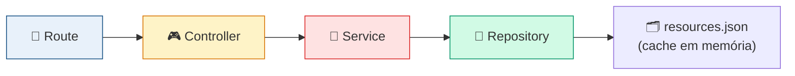
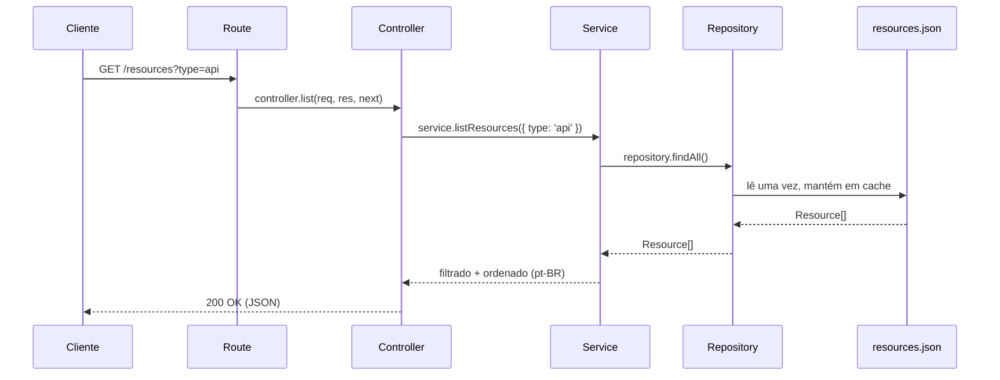
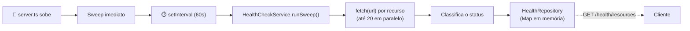

<div align="center">

# 🚏 api

**Backend REST do Buni API Hub — serve o catálogo de recursos e monitora a saúde de cada um deles, tudo em memória, sem banco de dados.**


</div>

---

## 📑 Índice

- [Objetivo](#-objetivo)
- [Arquitetura em camadas](#-arquitetura-em-camadas)
- [Fluxo de uma requisição](#-fluxo-de-uma-requisição)
- [Endpoints](#-endpoints)
- [Health Check](#-health-check)
- [Cache em memória](#-cache-em-memória)
- [Tratamento de erros](#-tratamento-de-erros)
- [Estrutura de pastas](#-estrutura-de-pastas)
- [Variáveis de ambiente](#-variáveis-de-ambiente)
- [Como executar](#-como-executar)
- [Scripts disponíveis](#-scripts-disponíveis)
- [➕ Como adicionar um endpoint novo](#-como-adicionar-um-endpoint-novo)
- [➕ Como adicionar um Service novo](#-como-adicionar-um-service-novo)
- [Como testar manualmente](#-como-testar-manualmente)
- [Boas práticas](#-boas-práticas)

---

## 🎯 Objetivo

Expor, via REST, o catálogo de recursos (APIs, Web Services e Sites) gerado pela [`ingestion/`](../ingestion/README.md), e o status de saúde de cada um — sem banco de dados, tudo servido a partir de um arquivo JSON estático e de caches em memória.

| A `api/` faz | A `api/` **não** faz |
| --- | --- |
| ✅ Servir o catálogo (`/resources`) | ❌ Autenticação/autorização |
| ✅ Agregações (`/summary`) | ❌ Persistência em banco de dados |
| ✅ Health check HTTP real e periódico | ❌ Cadastro, edição ou exclusão de recursos |
| ✅ Filtro/busca/ordenação no servidor | ❌ Upload de novos catálogos |
| ✅ Liveness do próprio processo | ❌ Documentação Swagger/OpenAPI |

---

## 🏗️ Arquitetura em camadas

Camadas clássicas, com **injeção de dependência manual via construtor** — sem framework de DI, sem decorators:



| Camada | Responsabilidade | Conhece Express? |
| --- | --- | --- |
| **Route** | Define o path HTTP e faz o *wiring* das camadas abaixo (`new Repository()` → `new Service()` → `new Controller()`). | Sim |
| **Controller** | Traduz HTTP ↔ domínio: lê `req.query`/`req.params`, chama o service, responde `res.json`. **Nenhuma regra de negócio.** | Sim |
| **Service** | Regras de negócio: filtros, busca, ordenação, classificação de health, agregações. Recebe e devolve só tipos de domínio. | Não |
| **Repository** | Acesso aos dados — leitura do `resources.json` (cache em memória) ou o Map em memória do health check. | Não |

> [!TIP]
> `ResourceService`/`HealthCheckService` não importam nada do Express — em tese, dariam para reaproveitar atrás de uma CLI ou fila no futuro, sem reescrever regra de negócio nenhuma.

---

## 🔄 Fluxo de uma requisição



Erros seguem o mesmo caminho de volta: `Service` lança `ApiError`, o `Controller` captura e repassa via `next(error)`, e o [middleware de erro](#-tratamento-de-erros) central decide a resposta HTTP.

---

## 🔗 Endpoints

| Método | Rota | Descrição |
| --- | --- | --- |
| `GET` | `/health` | Liveness do próprio servidor |
| `GET` | `/resources` | Lista o catálogo completo (aceita `?type=`, `?environment=`, `?search=`) |
| `GET` | `/resources/:id` | Um recurso específico |
| `GET` | `/summary` | Contagens agregadas por tipo |
| `GET` | `/health/resources` | Status de saúde de **todos** os recursos |
| `GET` | `/health/resources/:id` | Status de saúde de **um** recurso |

> [!NOTE]
> `/health` (liveness do servidor) e `/health/resources` (saúde dos recursos monitorados) são conceitos diferentes, de propósito: o primeiro existe desde o início do backend; o segundo foi adicionado depois, para o health check dos recursos — e ficou sob `/health/resources` exatamente para não colidir com o liveness já em uso.

### `GET /health`

```json
{ "status": "UP" }
```

### `GET /resources` <sub>(também aceita `?type=api|web-service|site`, `?environment=homologacao|producao|unknown`, `?search=texto`)</sub>

```json
[
  {
    "id": "api-fiapiautclientepf",
    "type": "api",
    "displayName": "WebApi - Cadastro/Consulta de Cliente PF",
    "name": "WebApi - Cadastro/Consulta de Cliente PF",
    "technicalName": "FIApiAutClientePF",
    "code": "APIDADCLIPF",
    "url": "https://buncghml.funcao.digital/API/FIApiAutClientePF",
    "environment": "homologacao",
    "deprecated": false,
    "active": true,
    "keywords": ["cadastro/consulta", "cliente", "aut", "apidadclipf", "api", "homologacao"],
    "tags": [],
    "searchIndex": ["webapi - cadastro/consulta de cliente pf", "fiapiautclientepf", "..."]
  }
]
```

### `GET /resources/:id`

Mesmo formato de um item acima. Responde **404** (`{ "error": "Recurso não encontrado: <id>" }`) se o id não existir.

### `GET /summary`

```json
{ "total": 156, "apis": 127, "webServices": 6, "sites": 23 }
```

### `GET /health/resources`

```json
[
  {
    "resourceId": "api-fiapiautclientepf",
    "status": "online",
    "httpStatus": 200,
    "responseTime": 143,
    "lastCheckedAt": "2026-07-13T17:32:39.961Z"
  }
]
```

### `GET /health/resources/:id`

Mesmo formato de um item acima. Responde **404** se o `id` do recurso não existir; se o recurso existe mas ainda não passou por nenhuma varredura, devolve `{ "status": "unknown", "lastCheckedAt": "<agora>" }` em vez de quebrar.

---

## ❤️ Health Check

O backend verifica, periodicamente e de verdade (requisição HTTP real, não simulada), a URL de cada recurso do catálogo.



### Como classifica

| Situação | Status |
| --- | --- |
| Recurso sem URL cadastrada | `unknown` — não há o que checar |
| Timeout, erro de rede ou DNS inválido | `offline` |
| HTTP `>= 500` | `offline` |
| HTTP `2xx`/`3xx`, dentro do prazo | `online` |
| HTTP `2xx`/`3xx`, acima do prazo | `slow` |
| Qualquer outro caso (`4xx`, por exemplo) | `unknown` — a resposta não indica claramente que o recurso está fora do ar |

```ts
// healthCheck.service.ts
private classify(httpStatus: number, responseTime: number): ResourceStatus {
  if (httpStatus >= 500) return 'offline'
  if (httpStatus >= 200 && httpStatus < 400) {
    return responseTime > this.options.slowThresholdMs ? 'slow' : 'online'
  }
  return 'unknown'
}
```

### Como atualiza

- Um **sweep imediato** roda assim que o servidor sobe (para `/health/resources` nunca ficar vazio).
- Depois, um `setInterval` dispara uma nova varredura a cada `HEALTH_CHECK_INTERVAL_MS` (default **60s**).
- Cada varredura processa os recursos com **concorrência limitada** (`HEALTH_CHECK_CONCURRENCY`, default **20** por vez) via um pool de promises artesanal (`utils/promisePool.ts`) — sem biblioteca externa, para não abrir uma conexão simultânea por recurso do catálogo inteiro.
- O resultado fica em um `Map<resourceId, ResourceHealth>` em memória (`HealthRepository`) — **perdido a cada restart**, repovoado em segundos pelo sweep inicial.

### Como o frontend consome

A `web/` usa `refetchInterval: 60_000` no React Query (mesmo intervalo do backend) — pedir mais rápido que isso só devolveria o mesmo dado. Detalhes em [web/README.md](../web/README.md#-health-check-no-frontend).

---

## 💾 Cache em memória

Não há banco de dados em lugar nenhum — dois caches simples, em memória, no processo:

| Cache | Onde | O que guarda | Quando é populado |
| --- | --- | --- | --- |
| `ResourceRepository` | `repositories/resource.repository.ts` | O array de `Resource` lido de `src/data/resources.json` | Uma vez, no primeiro acesso (`fs.readFileSync` lazy) |
| `HealthRepository` | `repositories/health.repository.ts` | `Map<resourceId, ResourceHealth>` | A cada sweep do Health Check |

---

## ⚠️ Tratamento de erros

```ts
// utils/ApiError.ts
export class ApiError extends Error {
  readonly statusCode: number
  static notFound(message: string): ApiError { return new ApiError(404, message) }
}
```

- **`notFoundHandler`** — captura qualquer rota não registrada, responde `404` com `{ "error": "Rota não encontrada: <método> <path>" }`.
- **`errorHandler`** — middleware de erro do Express (assinatura de 4 parâmetros). Se o erro for um `ApiError`, responde com o `statusCode` e mensagem dele; qualquer outro erro vira `500` genérico (logado no console, nunca vazado ao cliente).

---

## 📁 Estrutura de pastas

```text
api/
├── scripts/
│   └── copy-data.mjs            Copia src/data/ → dist/data/ no build
└── src/
    ├── app.ts                   Fábrica do Express: cors → json → routes → 404 → errorHandler
    ├── server.ts                 Ponto de entrada: sobe o servidor e agenda o Health Check
    ├── config/
    │   └── env.ts                 Validação (Zod) das variáveis de ambiente
    ├── routes/
    │   ├── index.ts                Agrega health / resourceHealth / resource routes
    │   ├── health.routes.ts         GET /health
    │   ├── resourceHealth.routes.ts  GET /health/resources[/:id] — também faz o wiring do Health Check
    │   └── resource.routes.ts       GET /resources, /resources/:id, /summary
    ├── controllers/
    │   ├── health.controller.ts
    │   ├── resource.controller.ts
    │   └── resourceHealth.controller.ts
    ├── services/
    │   ├── resource.service.ts      Filtro, busca, ordenação, agregação
    │   └── healthCheck.service.ts   Sweep, classificação, concorrência
    ├── repositories/
    │   ├── resource.repository.ts   Leitura + cache do resources.json
    │   └── health.repository.ts     Map em memória do último health check
    ├── models/
    │   └── resource.model.ts        Resource, ResourceHealth (espelha ingestion/src/types.ts)
    ├── types/
    │   └── resourceSummary.type.ts
    ├── middleware/
    │   ├── errorHandler.ts
    │   └── notFoundHandler.ts
    ├── utils/
    │   ├── ApiError.ts
    │   ├── normalizeSearchTerm.ts   (mesma lógica usada no filterResources.ts do frontend)
    │   └── promisePool.ts           Concorrência limitada, sem biblioteca externa
    └── data/
        └── resources.json          Copiado manualmente de ingestion/output/
```

---

## ⚙️ Variáveis de ambiente

Todas têm valor default — nada é obrigatório para rodar localmente (`.env.example` já reflete os defaults).

| Variável | Default | Descrição |
| --- | --- | --- |
| `PORT` | `3333` | Porta HTTP do servidor |
| `HEALTH_CHECK_INTERVAL_MS` | `60000` | Intervalo entre varreduras do Health Check |
| `HEALTH_CHECK_TIMEOUT_MS` | `5000` | Timeout de cada checagem HTTP individual |
| `HEALTH_CHECK_SLOW_THRESHOLD_MS` | `1000` | Acima disso, um recurso saudável vira `slow` |
| `HEALTH_CHECK_CONCURRENCY` | `20` | Quantas checagens rodam em paralelo por varredura |

---

## ▶️ Como executar

```bash
cd api
npm install
cp .env.example .env
npm run dev
```

A API sobe em `http://localhost:3333` (ou na porta definida em `PORT`).

> [!IMPORTANT]
> Requer `src/data/resources.json` já existir — copie-o de `ingestion/output/resources.json` antes do primeiro boot. Ver [ingestion/README.md](../ingestion/README.md#-atualizando-o-catálogo).

## 📜 Scripts disponíveis

| Comando | Descrição |
| --- | --- |
| `npm run dev` | Sobe o servidor em modo desenvolvimento (`tsx watch`, recarrega ao salvar) |
| `npm run build` | Compila para `dist/` e copia `src/data/resources.json` junto |
| `npm run start` | Roda a versão compilada (`dist/server.js`) — requer `build` antes |
| `npm run typecheck` | Verifica os tipos com `tsc --noEmit` |
| `npm run lint` | Roda o ESLint |
| `npm run lint:fix` | Roda o ESLint corrigindo o que for automaticamente corrigível |
| `npm run format` | Formata o projeto com Prettier |

---

## ➕ Como adicionar um endpoint novo

1. **Repository** (se precisar de um dado novo) — método puro de acesso a dado, sem lógica de negócio.
2. **Service** — a regra de negócio propriamente dita, recebendo/devolvendo tipos de domínio.
3. **Controller** — um método que só lê `req`, chama o `service` e responde `res.json(...)`, com `try/catch` repassando pro `next(error)`.
4. **Route** — registre o path chamando o método do controller; se for uma camada nova (não um endpoint a mais de uma já existente), crie o *wiring* (`new Repository()` → `new Service()` → `new Controller()`) no topo do arquivo de rota, no mesmo padrão de `resource.routes.ts`.
5. Registre o router novo em `routes/index.ts`.

```ts
// exemplo minimal, seguindo o padrão de resource.routes.ts
const repository = new MinhaRepository()
const service = new MeuService(repository)
const controller = new MeuController(service)

export const minhasRoutes = Router()
minhasRoutes.get('/meu-endpoint', controller.list)
```

## ➕ Como adicionar um Service novo

Um Service é uma classe simples, injetada via construtor, **sem nenhum import de `express`**:

```ts
export class MeuService {
  constructor(private readonly repository: MinhaRepository) {}

  minhaRegra(): AlgumTipoDeDominio {
    // só lógica de negócio — filtros, cálculos, validações
  }
}
```

Isso é o que garante que qualquer regra de negócio nova continue testável/reaproveitável fora do contexto HTTP.

---

## 🧪 Como testar manualmente

Não há suíte automatizada (`npm test`) configurada neste projeto. A validação de cada sprint foi feita com chamadas reais:

```bash
curl -s http://localhost:3333/health
curl -s http://localhost:3333/summary
curl -s http://localhost:3333/resources | head -c 300
curl -s "http://localhost:3333/resources?type=api&search=cliente"
curl -s http://localhost:3333/health/resources | head -c 300
curl -s -w "\n%{http_code}\n" http://localhost:3333/resources/id-que-nao-existe
```

---

## ✅ Boas práticas

- ✔️ Controllers nunca contêm regra de negócio — se você está filtrando/ordenando dentro de um controller, isso pertence ao Service.
- ✔️ Services nunca importam `express` — se um método precisa de `req`/`res`, a assinatura está na camada errada.
- ✔️ Rode `npm run typecheck && npm run lint && npm run build` antes de qualquer PR.
- ❌ Não adicione banco de dados, autenticação, Docker ou Swagger sem alinhar antes — são exclusões deliberadas de escopo até aqui, não lacunas a preencher por conta própria.
- ❌ Não edite `src/data/resources.json` manualmente — ele é sempre uma cópia do que a [`ingestion/`] gera.

---

<div align="center">

</div>
