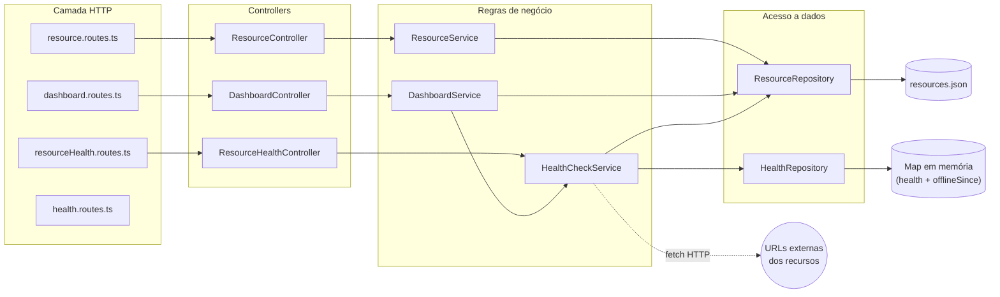
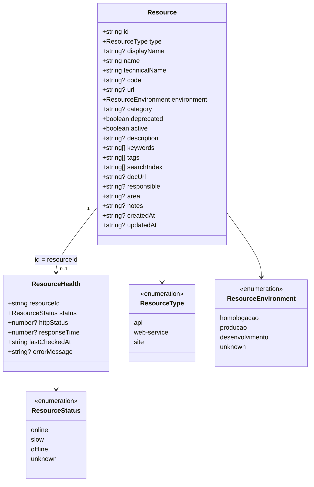
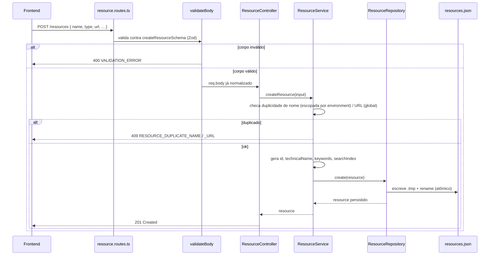
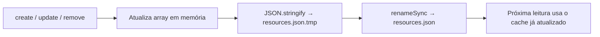
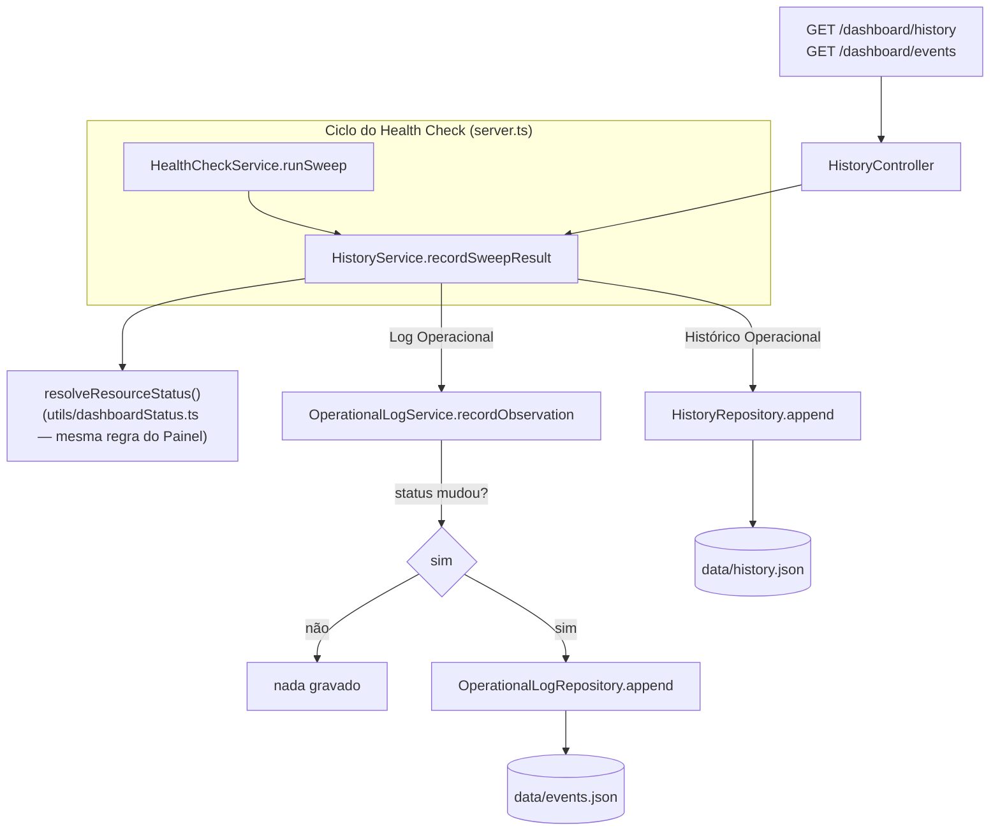

# Buni API Hub — API

API REST em Node.js/Express/TypeScript que centraliza o catálogo de APIs, Web Services e Sites da instituição, expõe um mecanismo de monitoramento de saúde em tempo real e serve os dados consumidos pelo Portal de Serviços (`web/`) e pelo Painel Operacional (`dashboard/`).

> Repositório: `buni-api-hub-api` · Parte do ecossistema **Buni API Hub** (`web/` — Portal de Serviços, `dashboard/` — Painel Operacional).

---

## Sumário

- [Visão geral](#visão-geral)
- [Objetivo](#objetivo)
- [Arquitetura](#arquitetura)
- [Stack tecnológica](#stack-tecnológica)
- [Estrutura de diretórios](#estrutura-de-diretórios)
- [Modelo de domínio](#modelo-de-domínio)
- [Endpoints](#endpoints)
- [Fluxo de Funcionamento](#fluxo-de-funcionamento)
- [Fluxo da aplicação](#fluxo-da-aplicação)
- [Fluxo dos Dados](#fluxo-dos-dados)
- [Persistência](#persistência)
- [Fluxo de Persistência](#fluxo-de-persistência)
  - [Consistência ambiente × URL](#consistência-ambiente--url)
- [Monitoramento de saúde e Painel Operacional](#monitoramento-de-saúde-e-painel-operacional)
- [Histórico Operacional e Log Operacional](#histórico-operacional-e-log-operacional)
- [Tratamento de erros](#tratamento-de-erros)
- [Validação](#validação)
- [Variáveis de ambiente](#variáveis-de-ambiente)
- [Como executar localmente](#como-executar-localmente)
- [Build e deploy](#build-e-deploy)
- [Padrões arquiteturais e boas práticas](#padrões-arquiteturais-e-boas-práticas)
- [Fluxo de desenvolvimento](#fluxo-de-desenvolvimento)
- [Roadmap / melhorias futuras](#roadmap--melhorias-futuras)
- [Licença](#licença)

---

## Visão geral

Esta API é a única porta de entrada para o catálogo de recursos da solução — é o backend que sustenta tanto o Portal de Serviços (`web/`) quanto o Painel Operacional (`dashboard/`), sem que nenhum dos dois se comunique entre si.

**Responsabilidades exclusivas desta API, nenhuma delas compartilhada com outro módulo:**

| Responsabilidade | Por quê é exclusiva desta API |
| --- | --- |
| **Única fonte oficial dos dados** | `api/src/data/resources.json` só existe e só é lido/escrito dentro deste repositório. |
| **Única responsável pela persistência** | `ResourceRepository` é a única classe do sistema com permissão de escrita sobre o catálogo. |
| **Única responsável pelas regras de negócio** | Validação de duplicidade, geração de `id`/`technicalName`/`keywords`/`searchIndex`, timestamps — tudo em `ResourceService`, nunca no frontend. |
| **Única responsável pelo Health Check** | `HealthCheckService` varre as URLs cadastradas de forma autônoma; nenhum frontend dispara ou depende de checagem própria. |
| **Única responsável pelos indicadores do Dashboard** | `DashboardService` agrega catálogo + saúde num payload consolidado; `dashboard/` só exibe o que recebe, sem calcular nada. |

Em todo erro, a API retorna um envelope padronizado (`status`, `code`, `message`) para que nenhum frontend precise interpretar mensagens técnicas.

**A API é totalmente independente em tempo de execução.** A fonte de dados é o `ResourceRepository` (`src/repositories/resource.repository.ts`), que lê e escreve exclusivamente em `src/data/resources.json` — o catálogo efetivamente usado pela aplicação. Toda operação de escrita (criar, editar, excluir, alterar status), disparada pelo Portal ou por qualquer outro cliente HTTP, persiste diretamente nesse arquivo através do `ResourceRepository`, cujo conteúdo permanece em cache em memória durante a execução do processo (detalhes em [Fluxo dos Dados](#fluxo-dos-dados), [Fluxo de Persistência](#fluxo-de-persistência)).

## Objetivo

Eliminar o processo manual de editar o arquivo de catálogo e fazer deploy toda vez que um novo recurso precisa entrar no ar, ao mesmo tempo em que fornece uma fonte única e sempre atualizada de status operacional dos serviços — sem depender de o frontend fazer qualquer verificação própria.

## Arquitetura

Arquitetura em camadas (Route → Controller → Service → Repository), sem framework de DI — a composição é feita manualmente em cada arquivo de rota, que instancia e conecta repository → service → controller.


```mermaid
flowchart LR
    subgraph HTTP["Camada HTTP"]
        R1["resource.routes.ts"]
        R2["resourceHealth.routes.ts"]
        R3["dashboard.routes.ts"]
        R4["health.routes.ts"]
    end

    subgraph Controllers
        C1["ResourceController"]
        C2["ResourceHealthController"]
        C3["DashboardController"]
    end

    subgraph Services["Regras de negócio"]
        S1["ResourceService"]
        S2["HealthCheckService"]
        S3["DashboardService"]
    end

    subgraph Repositories["Acesso a dados"]
        REPO1["ResourceRepository"]
        REPO2["HealthRepository"]
    end

    DATA[("resources.json")]
    MEM[("Map em memória<br/>(health + offlineSince)")]
    NET(("URLs externas<br/>dos recursos"))

    R1 --> C1 --> S1 --> REPO1 --> DATA
    R2 --> C2 --> S2
    R3 --> C3 --> S3
    S3 --> REPO1
    S3 --> S2
    S2 --> REPO2 --> MEM
    S2 -. "fetch HTTP" .-> NET
    S2 --> REPO1
```

Pontos-chave:

- **Uma única instância de `ResourceRepository`** é criada em `resource.routes.ts` e reexportada — `resourceHealth.routes.ts` e `dashboard.routes.ts` a reaproveitam, evitando caches divergentes do mesmo `resources.json`.
- **`HealthCheckService`** é o único componente que sabe fazer requisições HTTP de verificação; `DashboardService` só lê o resultado já calculado, nunca dispara checagem própria.
- Não há banco de dados. A persistência do catálogo é um arquivo JSON no próprio processo; o resultado do health check vive inteiramente em memória (é perdido a cada restart e repovoado em segundos pelo próximo sweep).

## Stack tecnológica

| Categoria | Tecnologia |
|---|---|
| Runtime | Node.js (ESM puro, `"type": "module"`) |
| Linguagem | TypeScript ~6.0 (`strict: true`) |
| Framework HTTP | Express ^5.2 |
| Validação | Zod ^4.4 |
| CORS | `cors` ^2.8 |
| Execução em dev | `tsx watch` |
| Lint/format | ESLint 10 (flat config) + Prettier 3.9 |
| Empacotamento | `tsc` (compilação direta, sem bundler) |

Testes automatizados usam o test runner nativo do Node (`node:test`, via `tsx --test`) + `supertest` para os testes de integração HTTP — sem dependência de Jest/Vitest. `typecheck` (`tsc --noEmit`) e `lint` continuam sendo as verificações estáticas complementares, todas rodadas no pipeline de CI (`.github/workflows/ci.yml`).

## Estrutura de diretórios

```
api/
├── src/
│   ├── config/
│   │   └── env.ts                  # validação Zod das env vars
│   ├── controllers/
│   │   ├── dashboard.controller.ts
│   │   ├── health.controller.ts
│   │   ├── history.controller.ts   # Histórico Operacional (snapshots) + Log Operacional (eventos)
│   │   ├── resource.controller.ts
│   │   └── resourceHealth.controller.ts
│   ├── services/
│   │   ├── dashboard.service.ts
│   │   ├── healthCheck.service.ts
│   │   ├── history.service.ts        # orquestra Histórico Operacional (snapshot) + Log Operacional (eventos) por sweep
│   │   ├── operationalLog.service.ts # Log Operacional — detecção de transição de status
│   │   └── resource.service.ts
│   ├── repositories/
│   │   ├── health.repository.ts
│   │   ├── history.repository.ts       # JsonHistoryRepository (implementa HistoryRepository) — Histórico Operacional
│   │   ├── operationalLog.repository.ts # JsonOperationalLogRepository (implementa OperationalLogRepository) — Log Operacional
│   │   └── resource.repository.ts
│   ├── routes/
│   │   ├── dashboard.routes.ts
│   │   ├── health.routes.ts
│   │   ├── history.routes.ts       # GET /dashboard/history, GET /dashboard/events
│   │   ├── index.ts                # agrega todas as rotas
│   │   ├── resource.routes.ts
│   │   └── resourceHealth.routes.ts
│   ├── middleware/
│   │   ├── errorHandler.ts
│   │   ├── notFoundHandler.ts
│   │   └── validateBody.ts
│   ├── validators/
│   │   └── resource.schema.ts      # schemas Zod de criação/edição
│   ├── models/
│   │   ├── history.model.ts         # HistorySnapshot + interface HistoryRepository — Histórico Operacional
│   │   ├── operationalLog.model.ts  # OperationalEvent + interface OperationalLogRepository — Log Operacional
│   │   └── resource.model.ts        # Resource, ResourceHealth e tipos relacionados
│   ├── types/
│   │   ├── dashboard.type.ts
│   │   └── resourceSummary.type.ts
│   ├── utils/
│   │   ├── ApiError.ts
│   │   ├── dashboardStatus.ts      # resolveResourceStatus/calculateAvailabilityPercentage (compartilhado)
│   │   ├── generateKeywordsAndIndex.ts
│   │   ├── normalizeSearchTerm.ts
│   │   ├── promisePool.ts          # runWithConcurrency (pool de workers)
│   │   ├── resolveResourceEnvironment.ts # URL → homologacao|producao|unknown (domínios oficiais)
│   │   └── slugify.ts
│   ├── data/
│   │   ├── events.json             # gerado em runtime — Log Operacional (eventos)
│   │   ├── history.json            # gerado em runtime — Histórico Operacional (snapshots)
│   │   └── resources.json          # catálogo oficial — única fonte de dados da aplicação, gerenciada pelo ResourceRepository
│   ├── app.ts                      # composição do Express (middlewares + rotas)
│   └── server.ts                   # bootstrap: agenda o sweep e sobe o servidor
├── scripts/
│   └── copy-data.mjs               # copia resources.json para dist/ no build
├── docs/
│   └── dashboard-operacional.md    # monitoramento e Painel Operacional, documentação completa
├── .env.example
├── eslint.config.js
├── tsconfig.json
└── package.json
```

## Modelo de domínio

`src/models/resource.model.ts` é a fonte de verdade — espelhada manualmente em `web/src/features/catalog/types.ts` e `dashboard/src/types/index.ts` (os três projetos são Node independentes, sem pacote compartilhado).


```mermaid
classDiagram
    class Resource {
        +string id
        +ResourceType type
        +string? displayName
        +string name
        +string technicalName
        +string? code
        +string? url
        +ResourceEnvironment environment
        +string? category
        +boolean deprecated
        +boolean active
        +string? description
        +string[] keywords
        +string[] tags
        +string[] searchIndex
        +string? docUrl
        +string? responsible
        +string? area
        +string? notes
        +string? createdAt
        +string? updatedAt
    }
    class ResourceHealth {
        +string resourceId
        +ResourceStatus status
        +number? httpStatus
        +number? responseTime
        +string lastCheckedAt
        +string? errorMessage
    }
    class ResourceType {
        <<enumeration>>
        api
        web-service
        site
    }
    class ResourceEnvironment {
        <<enumeration>>
        homologacao
        producao
        desenvolvimento
        unknown
    }
    class ResourceStatus {
        <<enumeration>>
        online
        slow
        offline
        unknown
    }
    Resource --> ResourceType
    Resource --> ResourceEnvironment
    ResourceHealth --> ResourceStatus
    Resource "1" --> "0..1" ResourceHealth : id = resourceId
```

Os campos `docUrl`, `responsible`, `area`, `notes`, `createdAt`, `updatedAt` são metadados do cadastro manual via API/Portal.

## Endpoints

Todas as respostas são JSON. Autenticação via JWT (`Authorization: Bearer <token>`) e autorização por papel (`ROLE_ADMIN`/`ROLE_USER`) estão implementadas — ver [Autenticação e autorização](#autenticação-e-autorização). Rotas marcadas com 🔒 exigem token válido; 🔒🛡️ exige adicionalmente `ROLE_ADMIN`.

### Tabela consolidada (verificada diretamente em `src/routes/*.ts`)

| Método | Endpoint | Autenticação | Role | Finalidade |
|---|---|---|---|---|
| `GET` | `/` | Pública | — | Metadados da API (`name`, `status`, `version`, `timestamp`) |
| `GET` | `/health` | Pública | — | Liveness do processo |
| `GET` | `/health/ready` | Pública | — | Readiness — `503` se o catálogo não carregou |
| `POST` | `/auth/login` | Pública (rate limit dedicado) | — | Login e-mail/senha, retorna JWT |
| `GET` | `/health/resources` | JWT | Qualquer autenticado | Último status conhecido de todos os recursos |
| `GET` | `/health/resources/:id` | JWT | Qualquer autenticado | Status de um recurso específico |
| `GET` | `/dashboard` | Pública | — | `{ summary, incidents }` combinados |
| `GET` | `/dashboard/rankings` | Pública | — | `{ slowest, mostUnstable }` |
| `GET` | `/dashboard/overview` | Pública | — | `{ summary, incidents, rankings }` consolidado — usado pelo Painel de TV |
| `GET` | `/dashboard/summary` | JWT | Qualquer autenticado | Só o resumo consolidado |
| `GET` | `/dashboard/incidents` | JWT | Qualquer autenticado | Só a lista de incidentes |
| `GET` | `/dashboard/history` | Pública | — | Histórico Operacional — snapshots agregados (até 2000 mais recentes) |
| `GET` | `/dashboard/events` | JWT | `ROLE_ADMIN` | Log Operacional — transições de status, filtrável |
| `POST` | `/admin/resources/promote-to-producao` | JWT | `ROLE_ADMIN` | Promoção em lote Homologação → Produção |
| `GET` | `/resources` | JWT | Qualquer autenticado | Lista o catálogo (`?type=`, `?environment=`, `?search=`) |
| `GET` | `/resources/:id` | JWT | Qualquer autenticado | Um recurso específico |
| `GET` | `/summary` | JWT | Qualquer autenticado | Contagem por tipo |
| `POST` | `/resources` | JWT | `ROLE_ADMIN` | Cria um recurso |
| `PUT` | `/resources/:id` | JWT | `ROLE_ADMIN` | Atualiza parcialmente |
| `DELETE` | `/resources/:id` | JWT | `ROLE_ADMIN` | Remove um recurso |
| `POST` | `/resources/:id/usage` | JWT | Qualquer autenticado | Registra uso do recurso — sem consumidor real hoje (ver [Roadmap](#roadmap--melhorias-futuras)) |

As tabelas por grupo de rota, abaixo, repetem a mesma informação com mais contexto de negócio.

### Catálogo (`resource.routes.ts`)

| Método | Rota | Descrição | Status de sucesso |
|---|---|---|---|
| `GET` | 🔒 `/resources` | Lista o catálogo. Aceita `?type=`, `?environment=`, `?search=` | 200 |
| `GET` | 🔒 `/resources/:id` | Um recurso específico | 200 / 404 |
| `GET` | 🔒 `/summary` | Contagem por tipo (`total`, `apis`, `webServices`, `sites`) | 200 |
| `POST` | 🔒🛡️ `/resources` | Cria um recurso (`createResourceSchema`) | 201 / 400 / 409 |
| `PUT` | 🔒🛡️ `/resources/:id` | Atualiza parcialmente (`updateResourceSchema`) | 200 / 400 / 404 / 409 |
| `DELETE` | 🔒🛡️ `/resources/:id` | Remove um recurso | 204 / 404 |

### Autenticação (`auth.routes.ts`)

| Método | Rota | Descrição | Status de sucesso |
|---|---|---|---|
| `POST` | `/auth/login` | Autentica por e-mail/senha (`users.json`), retorna JWT | 200 / 400 / 401 |

Limitado por um rate limit dedicado (`AUTH_RATE_LIMIT_MAX` tentativas a cada `AUTH_RATE_LIMIT_WINDOW_MS`, padrão 5 a cada 15min por IP) contra força bruta de senha.

### Administração (`resourcePromotion.routes.ts`)

| Método | Rota | Descrição | Status de sucesso |
|---|---|---|---|
| `POST` | 🔒🛡️ `/admin/resources/promote-to-producao` | Promove em lote todos os recursos de Homologação para Produção (idempotente, ver [Promoção em lote](#promoção-em-lote-homologação--produção)) | 200 / 422 |

### Saúde (`resourceHealth.routes.ts` / `health.routes.ts`)

| Método | Rota | Descrição |
|---|---|---|
| `GET` | `/health` | Liveness do processo — `{ status: 'UP' }`. Usado pelo `HEALTHCHECK` do Docker |
| `GET` | `/health/ready` | Readiness — confirma que o catálogo de recursos foi carregado do disco com sucesso; `503` caso contrário. Usado por load balancers/orquestradores para decidir se a instância entra no pool |
| `GET` | 🔒 `/health/resources` | Último status conhecido de todos os recursos |
| `GET` | 🔒 `/health/resources/:id` | Status de um recurso (`unknown` se ainda não varrido) |

### Painel Operacional (`dashboard.routes.ts`)

| Método | Rota | Autenticação | Descrição |
|---|---|---|---|
| `GET` | `/dashboard` | **Pública** | `{ summary, incidents }` combinados |
| `GET` | `/dashboard/rankings` | **Pública** | `{ slowest, mostUnstable }` |
| `GET` | `/dashboard/overview` | **Pública** | `{ summary, incidents, rankings }` — chamada única e consolidada, efetivamente usada pelo Painel de TV (`dashboard/`) |
| `GET` | 🔒 `/dashboard/summary` | JWT | Só o resumo consolidado |
| `GET` | 🔒 `/dashboard/incidents` | JWT | Só a lista de recursos que exigem atenção |

> **Públicas de propósito** (comentário explícito em `dashboard.routes.ts`): o Painel de TV (`dashboard/`) abre direto por URL, sem login, e consome só `GET /dashboard/overview` (chamada única e consolidada). `GET /dashboard` e `GET /dashboard/rankings` seguem públicas e no ar por compatibilidade, mesmo não sendo mais consumidas diretamente pelo Painel. `GET /dashboard/summary` e `GET /dashboard/incidents` continuam autenticadas por não serem usadas por esse painel.

### Histórico Operacional e Log Operacional (`history.routes.ts`)

| Método | Rota | Autenticação | Descrição |
|---|---|---|---|
| `GET` | `/dashboard/history` | **Pública** | Snapshots agregados do ambiente, um por sweep (até 2000 mais recentes) |
| `GET` | 🔒🛡️ `/dashboard/events` | JWT + `ROLE_ADMIN` | Transições reais de status por recurso, mais recente primeiro. Filtros opcionais via query string: `resourceId`, `status` (`online`\|`offline`\|`maintenance`\|`unknown`), `environment`, `since`/`until` (ISO 8601, sobre `timestamp`) — todos combináveis; valor inválido é ignorado (mesmo comportamento de `GET /resources`) |

> `GET /dashboard/history` é pública de propósito (mesmo motivo de `/dashboard` acima — consumida pelo Painel de TV, que abre sem login). `GET /dashboard/events` é o Log Operacional do portal administrativo (`web/`), não do Painel de TV, e por isso continua exigindo `ROLE_ADMIN`.

### Raiz

| Método | Rota | Descrição |
|---|---|---|
| `GET` | `/` | Metadados da API (`name`, `status`, `version`, `timestamp`) |

## Fluxo de Funcionamento

Sequência real de inicialização (`src/server.ts`), do processo subindo até o primeiro dado disponível para os frontends:

```
Inicialização do processo
        │
        ▼
Validação das variáveis de ambiente (config/env.ts, Zod)
        │  falha aqui derruba o processo (fail-fast)
        ▼
Composição do Express (app.ts: cors, json, rotas, error handlers)
        │
        ▼
Carregamento do catálogo (resources.json → ResourceRepository, leitura lazy no primeiro acesso)
        │
        ▼
Sweep inicial do Health Check (disparado imediatamente, antes de o servidor aceitar requisições)
        │
        ├─▶ Verificação HTTP de cada recurso cadastrado (HealthCheckService, concorrência limitada)
        ├─▶ Classificação de status (online/slow/offline/unknown) → HealthRepository (memória)
        ├─▶ Snapshot agregado do ambiente → Histórico Operacional (history.json)
        └─▶ Transições de status por recurso → Log Operacional (events.json), só quando muda
        │
        ▼
app.listen(PORT) — servidor aceita requisições HTTP
        │
        ▼
setInterval a cada HEALTH_CHECK_INTERVAL_MS — repete o sweep indefinidamente
        │
        ▼
Consumo pelos frontends: GET /resources, /dashboard*, /health* (web/, dashboard/) — sempre leitura do estado já calculado, nunca uma checagem sob demanda
```

1. **Inicialização da API** — `server.ts` importa `config/env.ts`; a validação Zod roda na importação do módulo, antes de qualquer outra coisa. Uma env var inválida lança exceção e encerra o processo imediatamente (fail-fast, nunca falha silenciosa em runtime).
2. **Composição do Express** — `app.ts` monta `cors`, `express.json`, todas as rotas (`routes/index.ts`) e os middlewares finais (`notFoundHandler`, `errorHandler`).
3. **Carregamento dos recursos** — não é um passo explícito de boot: `ResourceRepository` lê `resources.json` de forma *lazy*, na primeira chamada a `findAll()`/`findById()`. Na prática, isso acontece já no sweep inicial (próximo passo), então o catálogo está em memória antes do servidor aceitar a primeira requisição HTTP.
4. **Processo de monitoramento** — `runSweepAndRecordHistory()` roda uma vez imediatamente e depois a cada `HEALTH_CHECK_INTERVAL_MS` (`setInterval`), chamando `HealthCheckService.runSweep()`.
5. **Atualização dos status** — cada recurso é verificado via HTTP (`fetch`, timeout e concorrência configuráveis); o resultado (`online`/`slow`/`offline`/`unknown`, `httpStatus`, `responseTime`, `errorMessage` quando aplicável) fica em `HealthRepository`, só em memória.
6. **Registro do Histórico Operacional** — depois que o sweep termina, `HistoryService.recordSweepResult()` grava sempre um `HistorySnapshot` agregado do ambiente inteiro.
7. **Persistência** — o mesmo `recordSweepResult()` delega ao `OperationalLogService` a detecção de transições por recurso: só quando o status de um recurso muda é que um evento é gravado no Log Operacional. Snapshot e evento (quando existe) são persistidos de forma atômica (`.tmp` + `rename`) em `history.json`/`events.json`, respectivamente.
8. **Consumo pelo Dashboard** — `dashboard/` (via `GET /dashboard` e `GET /dashboard/history`) e `web/` (via `GET /dashboard/events`) só leem o que já foi calculado e persistido nos passos acima; nenhum dos dois frontends dispara uma verificação própria.

## Fluxo da aplicação

Requisição típica de escrita (`POST /resources`), mostrando as camadas envolvidas:


```mermaid
sequenceDiagram
    participant Client as Frontend
    participant Route as resource.routes.ts
    participant Mid as validateBody
    participant Ctrl as ResourceController
    participant Svc as ResourceService
    participant Repo as ResourceRepository
    participant FS as resources.json

    Client->>Route: POST /resources { name, type, url, ... }
    Route->>Mid: valida contra createResourceSchema (Zod)
    alt corpo inválido
        Mid-->>Client: 400 VALIDATION_ERROR
    else corpo válido
        Mid->>Ctrl: req.body já normalizado
        Ctrl->>Svc: createResource(input)
        Svc->>Svc: checa duplicidade de nome (escopada por environment) / URL (global)
        alt duplicado
            Svc-->>Client: 409 RESOURCE_DUPLICATE_NAME / _URL
        else ok
            Svc->>Svc: gera id, technicalName, keywords, searchIndex
            Svc->>Repo: create(resource)
            Repo->>FS: escreve .tmp + rename (atômico)
            Repo-->>Svc: resource persistido
            Svc-->>Ctrl: resource
            Ctrl-->>Client: 201 Created
        end
    end
```

## Fluxo dos Dados

Todo cadastro, edição, exclusão ou alteração de status feito pelo Portal de Serviços segue sempre o mesmo caminho, de ponta a ponta, sem atalhos e sem depender de nenhum processo externo:

```
Portal de Serviços
        │
        ▼
REST API
        │
        ▼
ResourceService
        │
        ▼
ResourceRepository
        │
        ▼
api/src/data/resources.json
```

1. O usuário realiza uma ação no Portal (ex.: salvar um novo recurso no formulário de Cadastro).
2. O Frontend envia a requisição HTTP correspondente (`POST`/`PUT`/`DELETE /resources`) para a REST API.
3. A rota valida o corpo da requisição e delega para o `ResourceController`, que por sua vez chama o `ResourceService`.
4. O `ResourceService` aplica as regras de negócio (checagem de duplicidade, geração de `id`/`technicalName`/`keywords`/`searchIndex`, timestamps) e chama o `ResourceRepository`.
5. O `ResourceRepository` atualiza o array em cache (memória) e grava o resultado em `api/src/data/resources.json` de forma atômica (`.tmp` + `rename`).
6. A partir desse momento, qualquer leitura (catálogo do Portal, Painel Operacional, health check) reflete o dado já persistido, servido diretamente do cache em memória do `ResourceRepository` — sem reler o disco a cada requisição.

## Persistência

`ResourceRepository` (`src/repositories/resource.repository.ts`) é a **única** camada que conhece o arquivo `src/data/resources.json`.

- Leitura *lazy*: o arquivo é lido uma vez (`readFileSync`) na primeira chamada e mantido em cache em memória — não há I/O de disco nas leituras seguintes.
- Escrita atômica: toda mutação (`create`/`update`/`remove`) grava em `resources.json.tmp` e depois faz `renameSync` para o arquivo final, evitando corromper o catálogo se o processo for interrompido no meio da escrita.
- Não há banco de dados. Esta é uma decisão deliberada da sprint atual — ver [Roadmap](#roadmap--melhorias-futuras) para a migração planejada.


```mermaid
flowchart LR
    A["create / update / remove"] --> B["Atualiza array em memória"]
    B --> C["JSON.stringify → resources.json.tmp"]
    C --> D["renameSync → resources.json"]
    D --> E["Próxima leitura usa o cache já atualizado"]
```

## Fluxo de Persistência

As quatro operações de escrita da aplicação passam exatamente pelo mesmo caminho (Route → `validateBody` → Controller → Service → Repository → disco) — o que muda entre elas é só o método HTTP e a validação aplicada.

### Criação

`POST /resources` → `validateBody(createResourceSchema)` → `ResourceController.create` → `ResourceService.createResource`:

1. Valida duplicidade de `name` (escopada por `environment` — ver [Unicidade de nome por ambiente](#unicidade-de-nome-por-ambiente)) e de `url` (case-insensitive, trim, **global**) contra `repository.findAll()` — se houver, `409 RESOURCE_DUPLICATE_NAME`/`_URL`.
2. Valida consistência entre `environment` e `url` — se houver, `422 RESOURCE_ENVIRONMENT_MISMATCH` (ver [Consistência ambiente × URL](#consistência-ambiente--url) abaixo).
3. Gera `id` (`${type}-${environment}-${slug(technicalName)}`, ver [Geração de id](#geração-de-id)), `technicalName`, `keywords`, `searchIndex` e `createdAt`/`updatedAt`.
4. Chama `ResourceRepository.create()`, que adiciona ao array em cache e persiste (`.tmp` + `rename`).
5. Resposta `201 Created` com o recurso já persistido.

### Edição

`PUT /resources/:id` → `validateBody(updateResourceSchema)` → `ResourceController.update` → `ResourceService.updateResource`:

1. Busca o recurso existente — `404 RESOURCE_NOT_FOUND` se não existir.
2. Calcula os valores efetivos pós-merge de `name`/`url`/`environment` (PATCH sobrepõe o registro existente).
3. Revalida duplicidade de `name` (escopada pelo `environment` efetivo) e de `url` (global), excluindo o próprio `id` da checagem.
4. Revalida consistência entre `environment` e `url` — usando os mesmos valores efetivos pós-merge (um PATCH que só manda `environment`, por exemplo, é validado contra a `url` que já estava salva).
5. Recalcula `searchIndex`/`keywords` se `name`, `description` ou `keywords` mudaram; atualiza `updatedAt`. **O `id` nunca é regerado numa edição** — nem quando `name` muda, nem quando `environment` muda (mesma política já existente para `name`, agora só estendida para cobrir `environment` também; ver [Geração de id](#geração-de-id)).
6. Chama `ResourceRepository.update()`, que substitui o registro no array em cache e persiste.

### Exclusão

`DELETE /resources/:id` → `ResourceController.remove` → `ResourceService.deleteResource`:

1. Busca o recurso — `404 RESOURCE_NOT_FOUND` se não existir.
2. Chama `ResourceRepository.remove()`, que retira o registro do array em cache e persiste.
3. Resposta `204 No Content`.

### Alteração de status

**Não é uma operação separada.** Ativar/desativar um recurso é uma edição comum — `PUT /resources/:id` com o campo `active` no corpo — e segue exatamente o fluxo de **Edição** acima. `resolveResourceStatus()` (`utils/dashboardStatus.ts`) usa esse campo (`active: false` → status `maintenance`, independentemente do resultado do Health Check) para decidir o status consolidado exibido no Painel Operacional e no Histórico Operacional — a mesma regra, reaproveitada nos dois lugares.

Em nenhum dos quatro casos existe um caminho alternativo de escrita: `HealthCheckService` e `DashboardService` só leem o estado já persistido, nunca o alteram.

### Unicidade de nome por ambiente

O Portal de Serviços suporta múltiplos ambientes (Homologação e Produção, com Desenvolvimento reservado para o futuro) **coexistindo no mesmo catálogo** — decisão de negócio que reflete a operação real: o mesmo recurso lógico (ex.: `FIApiAcessoGerenciaPIN`) é implantado em ambientes diferentes, com URLs diferentes, e ambas as versões precisam estar cadastradas simultaneamente.

`ResourceService.assertNoDuplicate(name, url, environment, excludeId?)` reflete essa regra com dois escopos diferentes por campo:

- **Nome** — único apenas dentro do mesmo `environment`. Dois recursos podem ter o mesmo `name` desde que estejam em ambientes diferentes; dois recursos no *mesmo* ambiente com o mesmo nome continuam bloqueados (`409 RESOURCE_DUPLICATE_NAME`).
- **URL** — única **globalmente**, independente de ambiente. Não faz sentido dois recursos diferentes apontarem para o mesmo endereço, mesmo em ambientes diferentes (`409 RESOURCE_DUPLICATE_URL`).

Essa é a única mudança na regra de duplicidade em si; a validação de [consistência ambiente × URL](#consistência-ambiente--url) abaixo continua funcionando exatamente como antes, checando a `url` contra o `environment` informado.

### Geração de id

O `id` é a chave primária do catálogo (`ResourceRepository` usa `resource.id` para localizar registros em `update`/`remove`; o frontend usa `resource.id` em favoritos, rotas de detalhe e nas chaves de listas React). Como o nome deixou de ser globalmente único, o `id` — que antes era derivado só de `type` + `technicalName` — precisava passar a encodar também o `environment`, senão duas linhas legitimamente diferentes (mesmo nome, ambientes diferentes) colidiriam no mesmo `id`.

`utils/slugify.ts::generateResourceId(type, environment, technicalName)`:

```
id = `${type}-${environment}-${slug(technicalName)}`
```

exemplo: `FIApiAcessoGerenciaPIN` em Homologação → `api-homologacao-fiapiacessogerenciapin`; a mesma API em Produção → `api-producao-fiapiacessogerenciapin`. `environment` fica no meio (não no fim) do formato de propósito: é um vocabulário fechado (4 valores possíveis) numa posição fixa, o que deixa o formato previsível de inspecionar mesmo lendo o JSON bruto — diferente do slug, que pode conter qualquer sequência de palavras do nome digitado.

**Imutável após a criação** — o `id` nunca é regerado numa edição, nem quando `name` muda (política que já existia antes desta mudança) nem quando `environment` muda (extensão da mesma política). Isso preserva referências externas ao `id` (favoritos no `localStorage` do Portal, filtros por `?resourceId=` no Log Operacional) através de uma edição comum.

#### Migração dos ids existentes

Antes desta mudança, `resources.json` tinha 155 registros, todos no formato antigo (`${type}-${slug}`, sem segmento de ambiente) — e, coincidentemente, todos com `environment: "homologacao"`. Para adotar o novo formato sem perder nenhum recurso cadastrado, foi executado um script de migração único (`api/scripts/migrate-resource-ids.ts`, mantido no repositório para auditoria — não faz parte do fluxo de execução normal da API):

1. Backup automático de `resources.json` antes de qualquer escrita (`resources.json.bak-<timestamp>`).
2. Recalcula o `id` de cada um dos 155 registros com `generateResourceId(type, environment, technicalName)` — todos ganharam o segmento `-homologacao-` (ex.: `api-fiapitabconsultaragencias` → `api-homologacao-fiapitabconsultaragencias`).
3. Validação de integridade antes de gravar: confirma que a contagem de registros não mudou e que não há colisão de `id` após a migração (aborta sem escrever se houver).
4. Escrita atômica do arquivo migrado.

Executada com o processo da API **parado**, para o cache em memória do `ResourceRepository` (que só é populado uma vez, na primeira leitura) não sobrescrever o arquivo recém-migrado no primeiro `create`/`update`/`remove` seguinte. Depois de migrado, o servidor foi reiniciado normalmente e recarregou o array já com os novos ids.

**Efeitos colaterais conhecidos e aceitos**, todos limitados a estado que não tem — e nunca teve — mecanismo de migração automática:

- **Favoritos** (`web/src/features/catalog/favoritesStore.ts`) — persistidos como `Set<string>` de `id`s no `localStorage` do navegador de cada usuário, sem qualquer vínculo com o backend. Favoritos marcados antes da migração ficam órfãos (apontam para um `id` que não existe mais) e precisam ser remarcados manualmente. Não há como migrar `localStorage` de um cliente a partir do servidor.
- **Log Operacional** (`events.json`) — os 1262 eventos históricos gravados antes da migração continuam referenciando `resourceId`s no formato antigo; **não foram reescritos**, por ser um log de auditoria (histórico do que já aconteceu não deveria ser reescrito retroativamente). Consequência prática: filtrar `GET /dashboard/events?resourceId=...` com um `id` novo não traz eventos anteriores à migração, e o `OperationalLogService`, ao carregar esses eventos no boot para popular seu mapa em memória de "último status conhecido" por recurso, não encontra correspondência para nenhum `id` novo. Isso é seguro por desenho: a própria regra de negócio do serviço é que a **primeira observação de um `resourceId` nunca gera evento** (evita duplicar o "nascimento" de um recurso como se fosse uma transição de status) — então essa lacuna de estado no boot não produz eventos falsos, só um período sem histórico de transição imediatamente após a migração até a próxima mudança real de status.
- **Histórico Operacional** (`history.json`) — não é afetado: os snapshots são agregados do ambiente inteiro, sem referência a `resourceId`.

### Consistência ambiente × URL

`ResourceService.assertEnvironmentMatchesUrl(environment, url)` — mesmo padrão de `assertNoDuplicate` (método privado, chamado por `createResource` e `updateResource`, lança `ApiError` que o `errorHandler` já sabe converter). Regra:

1. `utils/resolveResourceEnvironment.ts` identifica a qual domínio **oficial** (`RESOURCE_DOMAIN_HOMOLOGACAO`/`RESOURCE_DOMAIN_PRODUCAO`, ver [Variáveis de ambiente](#variáveis-de-ambiente)) a `url` pertence, comparando o `hostname` — devolve `'homologacao'`, `'producao'` ou `'unknown'`.
2. Se `'unknown'` (domínio não é nenhum dos dois oficiais — ex.: API de terceiro, parceiro) → **não valida nada**, o cadastro segue normalmente, qualquer que seja o `environment` escolhido.
3. Se o domínio detectado bate com o `environment` informado → ok.
4. Se o domínio detectado **diverge** do `environment` informado (ex.: `environment: "producao"` com URL do domínio oficial de Homologação) → `422 RESOURCE_ENVIRONMENT_MISMATCH`.

Deliberadamente **não** existe qualquer inferência automática de `environment` a partir da `url` — o campo continua 100% escolhido pelo usuário; a URL só é usada para *confirmar* consistência quando há um domínio oficial conhecido para comparar.

## Promoção em lote Homologação → Produção

Operação **administrativa**, fora do CRUD comum: popula o catálogo de Produção a partir dos recursos já cadastrados em Homologação, evitando recadastro manual de ~155 recursos cujo único dado que muda é o domínio da URL.

`POST /admin/resources/promote-to-producao` (sem corpo) → `ResourcePromotionController.promoteToProducao` → `ResourcePromotionService.promoteHomologacaoToProducao()`:

1. Lê todos os recursos com `environment: "homologacao"` via `ResourceRepository.findAll()`.
2. Para cada um, deriva a URL de Produção substituindo só a origem (protocolo + host) — `utils/substituteResourceDomain.ts` troca `RESOURCE_DOMAIN_HOMOLOGACAO` por `RESOURCE_DOMAIN_PRODUCAO` preservando path/query/hash — e faz o mesmo com `docUrl`, se presente e se pertencer ao mesmo domínio (senão fica como está).
3. Prevê o `id` que o recurso promovido teria (`generateResourceId(type, 'producao', slugify(name))` — mesma fórmula usada internamente por `createResource`) e, se um recurso com esse `id` já existir, **pula** (idempotente: rodar a operação várias vezes nunca duplica).
4. Caso contrário, monta um `CreateResourceInput` com todos os demais campos copiados do recurso de origem (`type`, `active`, `description`, `responsible`, `area`, `notes`, `category`, `code`, `tags`, `keywords`) e `environment: "producao"`, e chama **`ResourceService.createResource(input)`** — a mesma rotina usada por um cadastro manual comum, então toda validação (duplicidade de nome escopada por ambiente, duplicidade de URL global, consistência ambiente×URL) roda normalmente para cada recurso promovido. `keywords`/`searchIndex` são recalculados do zero por essa mesma chamada — nunca copiados como texto — o que também descarta um artefato legado: alguns registros antigos carregam o rótulo do próprio ambiente (`"homologacao"`) dentro do array `keywords`; esse token é filtrado antes de repassar, para não vazar um `"homologacao"` incorreto para dentro de um recurso de Produção.
5. `displayName` é o único campo copiado fora do `ResourceService`: não existe no schema de criação do CRUD (é um campo legado, populado apenas em registros mais antigos do catálogo), então é replicado com um `ResourceRepository.update()` direto, só quando presente na origem.
6. **Transacional (all-or-nothing) por compensação**: se qualquer recurso falhar (ex.: URL já usada por outro recurso não relacionado), a operação inteira é abortada e todos os recursos já criados *nesta mesma execução* são removidos antes de responder — o catálogo volta exatamente ao estado anterior. Não há suporte a transação real de banco de dados (não há banco de dados); esse é o equivalente possível num arquivo JSON.
7. Nunca lê nem grava nada em Homologação além da leitura inicial — os recursos de origem nunca são alterados.
8. Responde um relatório: `{ success, totalFoundInHomologacao, created, skipped, failed, rolledBack, items[], errors[] }`, `200` se `success: true`, `422` se a operação foi abortada/revertida. Cada item em `items[]` mostra `sourceId`, `name`, `status` (`created`/`skipped`/`error`/`rolled-back`) e `reason` quando aplicável — inclusive identificando exatamente qual recurso causou um abort, quando há um.

Não há campo "health check" no modelo `Resource` para copiar — status de disponibilidade nunca foi persistido por recurso, é sempre calculado ao vivo pelo `HealthCheckService` (ver [Monitoramento de saúde](#monitoramento-de-saúde-e-painel-operacional) abaixo). O recurso recém-criado em Produção passa a ser varrido normalmente a partir do próximo sweep, como qualquer outro recurso do catálogo — nada precisa ser copiado manualmente.

## Monitoramento de saúde e Painel Operacional

`HealthCheckService` roda de forma totalmente autônoma no backend — o frontend nunca dispara nem depende de uma checagem própria. Um sweep varre todas as URLs cadastradas (disparo imediato no boot + `setInterval` a cada `HEALTH_CHECK_INTERVAL_MS`), classifica cada recurso (`online`/`slow`/`offline`/`unknown`) e grava o resultado em memória (`HealthRepository`). Quando a falha não teve resposta HTTP alguma (timeout, DNS, conexão recusada), `ResourceHealth.errorMessage` guarda a mensagem real da exceção — consumida pelo Log Operacional (ver abaixo) para auditoria. `DashboardService` agrega esse resultado com o campo `active` de cada recurso numa visão consolidada de 4 status (`online`/`offline`/`maintenance`/`unknown`), servida pelos endpoints `/dashboard*`.

Documentação completa — agendamento, concorrência, tabela de classificação de status (os dois níveis: HTTP bruto e consolidado do Painel), fluxo Backend → Frontend, casos de uso, cenários de teste e limitações conhecidas — está em **[`docs/dashboard-operacional.md`](docs/dashboard-operacional.md)**.

## Histórico Operacional e Log Operacional

Evolução do Painel Operacional: além do estado *atual* do ambiente (`/dashboard`), a API mantém dois registros persistentes complementares do que já aconteceu — sem banco de dados, seguindo o mesmo padrão de arquivo JSON + cache em memória já usado por `ResourceRepository`. São dois conceitos oficiais do projeto, cada um com seu próprio arquivo de dados, modelo, repositório e service:

- **Histórico Operacional** → **métricas agregadas e série temporal**. Persistido em `history.json`. Um `HistorySnapshot` do ambiente inteiro, gravado a cada sweep do Health Check, sempre.
- **Log Operacional** → **eventos detalhados e auditoria**. Persistido em `events.json`. Um `OperationalEvent` por recurso, gravado só quando o status de fato muda — status anterior/novo, motivo, mensagem de erro real, duração da indisponibilidade, ambiente e origem da verificação.

Os nomes dos arquivos de dados (`history.json`/`events.json`) e das rotas (`GET /dashboard/history`/`GET /dashboard/events`) são mantidos por compatibilidade — os dois conceitos acima são a nomenclatura oficial usada em classes, comentários, documentação e interface a partir daqui.

### Objetivo

Alimentar gráficos de disponibilidade ao longo do tempo, timeline de incidentes e auditoria operacional. `dashboard/` (Painel Operacional/NOC) consome `GET /dashboard/history` (Histórico Operacional) para a tendência de disponibilidade; `web/` (Portal) consome `GET /dashboard/events` (Log Operacional) na tela **Log Operacional** (`/log-operacional`) para auditoria — listagem filtrável (recurso/status/ambiente/período) e exportação. Nenhum dos dois frontends grava nada aqui — é sempre o `HealthCheckService`/`HistoryService`/`OperationalLogService` desta API, via sweep automático.

### Histórico Operacional × Log Operacional — a diferença

| | **Histórico Operacional** (`HistorySnapshot`) | **Log Operacional** (`OperationalEvent`) |
|---|---|---|
| O que é | Uma fotografia agregada do ambiente inteiro | O registro de **um** recurso mudando de status |
| Quando é gravado | A cada sweep do Health Check, sempre | Só quando o status de um recurso realmente muda |
| Granularidade | Ambiente (total/online/offline/manutenção/desconhecidos/disponibilidade) | Por recurso (`ONLINE → OFFLINE`, `OFFLINE → ONLINE` etc.) |
| Para que serve | Gráfico de disponibilidade/evolução da saúde | Timeline de incidentes, últimas ocorrências, tempo de indisponibilidade, auditoria |
| Frequência típica | Uma entrada por sweep (ex.: a cada 30–60s) | Rara — só existe se algo de fato mudou |

Um sweep sem nenhuma mudança de status gera **1 entrada no Histórico Operacional e 0 no Log Operacional**. Isso é o comportamento esperado, não uma falha.

### Campos de um evento do Log Operacional (`OperationalEvent`)

Além do essencial (recurso, `previousStatus → currentStatus`, `reason`, `httpStatus`/`responseTime` quando existem), cada evento carrega dados voltados à auditoria — todos opcionais na leitura (eventos gravados antes desta evolução não os têm):

| Campo | Origem | Observação |
|---|---|---|
| `environment` | `Resource.environment` no momento do evento | Usado pelo filtro `?environment=` |
| `resourceUrl` | `Resource.url` no momento do evento | Preserva o dado mesmo se a URL do recurso for editada depois |
| `errorMessage` | Exceção real da checagem HTTP (`HealthCheckService`) | Só em falhas de rede (timeout/DNS/conexão recusada) sem resposta HTTP — quando há `httpStatus`, ele já é o motivo |
| `unavailabilityDurationMs` | Calculado por `OperationalLogService` (`lastTransitionAt`) | Só em eventos de recuperação (saindo de `offline`) — quanto tempo o recurso ficou indisponível |
| `origin` | Fixo em `'scheduled-sweep'` hoje | Tipo já é a união `'scheduled-sweep' \| 'manual'` — pronto para uma futura checagem manual sem migrar o formato |

### Arquitetura

Módulo novo, sem mover nenhum arquivo existente — segue a mesma convenção de camadas já usada pelo resto da API (`controllers/`, `services/`, `repositories/`, `models/`, `routes/` por responsabilidade, não por pasta de domínio aninhada). `HistoryService` orquestra os dois pilares a cada sweep; `HistoryController` expõe os dois endpoints:


```mermaid
flowchart TB
    subgraph Sweep["Ciclo do Health Check (server.ts)"]
        HC[HealthCheckService.runSweep]
        HC --> HS[HistoryService.recordSweepResult]
    end

    HS --> RS["resolveResourceStatus()<br/>(utils/dashboardStatus.ts — mesma regra do Painel)"]
    HS -->|"Log Operacional"| ES[OperationalLogService.recordObservation]
    ES -->|"status mudou?"| EW{"sim"}
    EW -->|não| Skip["nada gravado"]
    EW -->|sim| EAppend[OperationalLogRepository.append]

    HS -->|"Histórico Operacional"| HAppend[HistoryRepository.append]

    HAppend --> HJSON[("data/history.json")]
    EAppend --> EJSON[("data/events.json")]

    HTTP["GET /dashboard/history<br/>GET /dashboard/events"] --> HC2[HistoryController]
    HC2 --> HS
```

`server.ts` só passou a chamar `historyService.recordSweepResult(...)` depois que `runSweep()` termina, reaproveitando o resultado que o sweep já calculou (`resourceRepository.findAll()` + `healthCheckService.getAll()`). Nenhuma chamada HTTP adicional é feita para gerar snapshots ou eventos — a única mudança em `HealthCheckService` foi passar a capturar `errorMessage` na falha (ver seção anterior), consumido aqui pelo Log Operacional.

### Repository como interface — pronto para trocar de persistência

`HistoryRepository` (Histórico Operacional, `src/models/history.model.ts`) e `OperationalLogRepository` (Log Operacional, `src/models/operationalLog.model.ts`) são **interfaces**, não classes. `JsonHistoryRepository`/`JsonOperationalLogRepository` (`src/repositories/`) são a implementação atual — arquivo JSON, mesmo padrão de escrita atômica (`.tmp` + `rename`) de `ResourceRepository`. `HistoryService`/`OperationalLogService` dependem só da interface:

```ts
export class HistoryService {
  constructor(
    private readonly historyRepository: HistoryRepository, // interface, não JsonHistoryRepository
    private readonly operationalLogService: OperationalLogService,
  ) {}
}
```

Uma futura `PostgresHistoryRepository` ou `MongoHistoryRepository` bastaria implementar a mesma interface e ser trocada em `routes/history.routes.ts` — sem alterar `HistoryService`, `HistoryController`, os endpoints ou o Dashboard.

### Crescimento controlado — Histórico e Log sem crescimento ilimitado

- **`history.json`** (Histórico Operacional): mantém só os últimos **2000 snapshots** (`MAX_SNAPSHOTS`, em `history.repository.ts`) — a ~30–60s por sweep, cobre de ~16h a ~33h de histórico, suficiente para o gráfico de tendência do `dashboard/` (`HistoryPanel`) sem o arquivo crescer para sempre.
- **`events.json`** (Log Operacional): nunca recebe um evento repetido. `OperationalLogService` mantém em memória o último status conhecido de cada recurso (`lastKnownStatus`, semeado a partir do último evento persistido no boot) e só grava quando o status muda de fato — um recurso `ONLINE` por horas não gera nenhuma escrita nova. Limite de segurança de **2000 eventos** (`MAX_EVENTS`, em `operationalLog.repository.ts`).
- A primeira observação de um recurso (processo recém-iniciado, sem evento anterior persistido) nunca vira evento — evita gerar N eventos "fantasma" a cada restart do processo.

### Endpoints

| Método | Rota | Descrição |
|---|---|---|
| `GET` | `/dashboard/history` | Snapshots agregados do ambiente, um por sweep (até 2000 mais recentes) |
| `GET` | `/dashboard/events` | Transições reais de status por recurso, mais recente primeiro. Filtros opcionais via query string: `resourceId`, `status` (`online`\|`offline`\|`maintenance`\|`unknown`), `environment`, `since`/`until` (ISO 8601, sobre `timestamp`) — todos combináveis; valor inválido é ignorado (mesmo comportamento de `GET /resources`) |

## Tratamento de erros

Todo erro de negócio é lançado como `ApiError` (`src/utils/ApiError.ts`) e convertido pelo `errorHandler` (último middleware da cadeia) num envelope único:

```json
{
  "status": 409,
  "code": "RESOURCE_DUPLICATE_URL",
  "message": "Já existe um recurso cadastrado utilizando esta URL."
}
```

| Factory | Status | `code` padrão |
|---|---|---|
| `ApiError.badRequest(msg, code?)` | 400 | `VALIDATION_ERROR` |
| `ApiError.notFound(msg, code?)` | 404 | `RESOURCE_NOT_FOUND` |
| `ApiError.conflict(msg, code?)` | 409 | `RESOURCE_CONFLICT` |
| `ApiError.unprocessable(msg, code?)` | 422 | `BUSINESS_RULE_ERROR` |

`code`s efetivamente emitidos hoje: `VALIDATION_ERROR`, `RESOURCE_NOT_FOUND`, `RESOURCE_DUPLICATE_NAME`, `RESOURCE_DUPLICATE_URL`, `RESOURCE_ENVIRONMENT_MISMATCH` (422 — `environment` informado não bate com o domínio oficial da `url`, ver [Fluxo de Persistência](#fluxo-de-persistência)), `ROUTE_NOT_FOUND` (rota inexistente), `INTERNAL_ERROR` (qualquer erro não tratado, logado no console e nunca exposto ao cliente). `RESOURCE_CONFLICT` continua como default não emitido por nenhuma regra atual; `BUSINESS_RULE_ERROR` (também default de `ApiError.unprocessable`) passou a ter uso real — `RESOURCE_ENVIRONMENT_MISMATCH` é gerado pela mesma factory, só com um `code` mais específico.

## Validação

`validateBody` (middleware) roda o corpo da requisição contra um schema Zod (`validators/resource.schema.ts`) antes do controller. `createResourceSchema` exige `name`, `type`, `url` (validada como URL) e `environment`; `updateResourceSchema` é o mesmo schema com todos os campos opcionais (`.partial()`), permitindo PATCH parcial via `PUT`.

## Variáveis de ambiente

| Variável | Obrigatória | Default (schema) | Descrição |
|---|---|---|---|
| `NODE_ENV` | Não | `development` | `development` \| `test` \| `production`. Em `production`, `CORS_ORIGIN` vazio ou `JWT_SECRET=change-me` derrubam o boot |
| `PORT` | Não | `3333` | Porta HTTP do servidor |
| `LOG_LEVEL` | Não | `info` | Nível do logger estruturado (pino): `fatal`\|`error`\|`warn`\|`info`\|`debug`\|`trace`\|`silent` |
| `HEALTH_CHECK_INTERVAL_MS` | Não | `30000` | Intervalo entre sweeps de health check |
| `HEALTH_CHECK_TIMEOUT_MS` | Não | `5000` | Timeout por requisição de verificação |
| `HEALTH_CHECK_SLOW_THRESHOLD_MS` | Não | `1000` | Acima disso, um recurso saudável é classificado `slow` |
| `HEALTH_CHECK_CONCURRENCY` | Não | `20` | Nº máximo de checagens HTTP simultâneas |
| `RESOURCE_DOMAIN_HOMOLOGACAO` | Não | `https://buncghml.funcao.digital` | Domínio oficial de Homologação — usado só para validar consistência `environment`×`url` no CRUD (`ResourceService.assertEnvironmentMatchesUrl`, ver [Fluxo de Persistência](#fluxo-de-persistência)) |
| `RESOURCE_DOMAIN_PRODUCAO` | Não | `https://credito.buni.digital` | Domínio oficial de Produção — mesmo uso acima |
| `JWT_SECRET` | **Sim** | — | Segredo de assinatura do JWT (HS256). Mínimo de 32 caracteres; boot falha se ausente, curto, ou se valer `change-me` em produção |
| `JWT_EXPIRES_IN` | Não | `8h` | Validade do token emitido em `/auth/login` |
| `CORS_ORIGIN` | Em produção | `` (vazio) | Lista separada por vírgula das origens autorizadas. Vazio libera qualquer origem, mas **só** fora de produção |
| `TRUST_PROXY` | Não | `0` | Nº de proxies reversos confiáveis à frente da API (Render/Railway/ALB/Nginx tipicamente `1`). Afeta `req.ip` e o rate limit por IP |
| `RATE_LIMIT_WINDOW_MS` / `RATE_LIMIT_MAX` | Não | `900000` / `300` | Janela e limite do rate limit global (por IP) |
| `AUTH_RATE_LIMIT_WINDOW_MS` / `AUTH_RATE_LIMIT_MAX` | Não | `900000` / `5` | Janela e limite do rate limit específico de `/auth/login` (proteção contra força bruta) |

O `.env.example` do repositório define `HEALTH_CHECK_INTERVAL_MS=60000` — ou seja, o valor efetivo em desenvolvimento local (60s) é mais conservador que o default embutido no código (30s), que só vale se a variável estiver totalmente ausente. Validação via Zod em `config/env.ts`; se qualquer variável definida for inválida, o processo falha no boot com uma mensagem detalhada (fail-fast, não silencioso).

## Autenticação e autorização

JWT (HS256, `jsonwebtoken`) + hash de senha com `bcryptjs`. Usuários vivem em `src/data/users.json` (mesmo padrão de arquivo JSON do restante da persistência — sem endpoint de criação/gestão de usuário; adicionar um usuário hoje é um passo manual de editar o arquivo e gerar o hash com bcrypt).

- `POST /auth/login` valida e-mail/senha contra `users.json` e devolve `{ token, user }`. Mensagem de erro idêntica para "usuário inexistente" e "senha incorreta" (`401 INVALID_CREDENTIALS`), evitando enumeração de usuários.
- `middleware/authenticate.ts` exige `Authorization: Bearer <token>` válido; popula `req.user`.
- `middleware/authorize.ts` (`authorize('ROLE_ADMIN')`) verifica o papel do usuário autenticado (`ROLE_ADMIN`/`ROLE_USER`).
- Rotas de escrita (`POST`/`PUT`/`DELETE` em `/resources`, promoção de ambiente, `/dashboard/events`) exigem `ROLE_ADMIN`; rotas de leitura autenticadas aceitam qualquer papel.

## Segurança de transporte e abuso

- **Helmet** (`helmet()`) define os headers de segurança HTTP padrão (CSP, `X-Content-Type-Options`, etc.).
- **CORS restritivo**: `CORS_ORIGIN` define as origens autorizadas; produção recusa subir sem essa variável.
- **Rate limiting**: limite global por IP (`RATE_LIMIT_*`) e um limite específico, mais restritivo, em `/auth/login` (`AUTH_RATE_LIMIT_*`) contra força bruta de senha.
- **Compressão** (`compression()`) e limite de payload (`express.json({ limit: '1mb' })`).
- **`trust proxy`** configurável via `TRUST_PROXY` — necessário para rate limit e `req.ip` corretos atrás de um load balancer.

## Logging

Logger estruturado com **pino** + **pino-http** (`middleware/requestLogger.ts`): gera/propaga um `X-Request-Id` (reaproveita o header recebido ou cria um novo via `randomUUID()`), nível dinâmico por status da resposta (`error` em 5xx ou exceção, `warn` em 4xx, `info` no restante), com serializers customizados para reduzir a verbosidade de `req`/`res` no log. Nível mínimo configurável via `LOG_LEVEL`. Em desenvolvimento, `pino-pretty` formata a saída para leitura humana no terminal.

## Como executar localmente

Pré-requisitos: Node.js compatível com ESM/TypeScript 6, npm.

```bash
cd api
cp .env.example .env      # ajuste os valores se necessário
npm install
npm run dev                # tsx watch — recarrega a cada mudança
```

O servidor sobe em `http://localhost:3333` (ou o valor de `PORT`), executa o sweep inicial de health check imediatamente e depois periodicamente.

Outros scripts:

```bash
npm run typecheck   # tsc --noEmit
npm run lint         # eslint .
npm run lint:fix
npm run format       # prettier --write .
npm test             # node:test via tsx --test, inclui testes de integração com supertest
```

Hook de pre-commit (Husky + lint-staged) roda `eslint --fix` + `prettier --write` nos arquivos `.ts` staged automaticamente (`npm install` executa `prepare` para instalar o hook).

## Build e deploy

```bash
npm run build   # tsc (compila src/ → dist/) + copy-data.mjs (copia os JSONs de src/data/)
npm run start    # node dist/server.js
```

`scripts/copy-data.mjs` é necessário porque `tsc` só compila arquivos `.ts` — sem essa etapa, `dist/data/resources.json` não existiria e o `ResourceRepository` falharia ao subir em produção. O script ignora explicitamente arquivos de backup (`*.bak*`) para não inflar a imagem de produção.

### Persistência de dados — restrição válida em qualquer plataforma

A camada de dados desta API é um conjunto de arquivos JSON (`resources.json`, `history.json`, `events.json`, `users.json`) lidos/gravados em disco, protegidos contra escrita concorrente por um lock de arquivo (`utils/fileLock.ts`, baseado em `mkdir` atômico, cross-process). Isso é uma decisão de arquitetura deliberada, não uma pendência — mas implica duas restrições que valem para **qualquer** plataforma de deploy:

1. **Volume persistente obrigatório**: sem um volume/disco montado em `dist/data`, os dados voltam ao estado embutido na imagem a cada redeploy/restart (a maioria das plataformas de container usa filesystem efêmero por padrão).
2. **Instância única**: múltiplos processos escrevendo no mesmo arquivo, mesmo com o lock, não substituem um catálogo compartilhado de verdade — o lock evita corrupção/"lost update", mas a app deve rodar com 1 réplica.

| Plataforma | Como persistir | Arquivo de referência |
|---|---|---|
| Docker Compose (VPS/servidor Linux) | Volume nomeado montado em `/app/dist/data` | [`docker-compose.prod.yml`](docker-compose.prod.yml) |
| Render | Render Disk montado em `/app/dist/data`, plano ≥ Starter, 1 instância | [`render.yaml`](render.yaml) |
| Railway | Railway Volume (configurado no dashboard) montado em `/app/dist/data`, `numReplicas: 1` | [`railway.toml`](railway.toml) |
| Kubernetes | `PersistentVolumeClaim` `ReadWriteOnce`, `Deployment` com `replicas: 1` e `strategy: Recreate` | [`deploy/k8s/`](deploy/k8s/) |
| AWS (ECS/Fargate) | Volume EFS montado no task definition | [`deploy/aws/ecs-task-definition.json`](deploy/aws/ecs-task-definition.json) |
| Azure Container Apps | Azure Files montado como volume no Container App (persistente, `ReadWriteMany` mas com a mesma restrição de instância única para escrita seria necessária no app) | Configuração equivalente ao ECS acima, via Azure CLI/Portal |
| Google Cloud Run | **Não recomendado** sem adaptação — Cloud Run não oferece disco persistente nativo entre revisões; usar Compute Engine/GKE com volume, seguindo o padrão do Kubernetes acima |

### CI/CD

Pipeline em [`.github/workflows/ci.yml`](.github/workflows/ci.yml): a cada push/PR, roda `npm ci`, `lint`, `typecheck`, `build`, `test` e `npm audit --audit-level=high` no Node 22.

## Padrões arquiteturais e boas práticas

- **Separação em camadas** (Route → Controller → Service → Repository) com responsabilidade única por camada: controllers só traduzem HTTP↔domínio, services concentram regra de negócio e nunca conhecem Express, repositories são o único ponto de acesso a dados.
- **Repository Pattern** isolando toda a lógica de leitura/escrita do `resources.json`, preparando o terreno para trocar a persistência por um banco de dados sem tocar em service/controller/route.
- **Injeção de dependência manual** via construtor (`new ResourceService(resourceRepository)`), sem container de DI — simples e suficiente para o tamanho atual do projeto.
- **Fail-fast de configuração**: env vars inválidas derrubam o processo no boot, nunca falham silenciosamente em runtime.
- **Envelope de erro único e estável** (`status`/`code`/`message`), permitindo que o frontend trate qualquer erro de forma genérica.
- **Escrita atômica em disco** (tmp + rename) para nunca deixar o catálogo num estado corrompido.
- **Tipagem forte de ponta a ponta** (TypeScript `strict`, schemas Zod inferindo tipos via `z.infer`).

## Fluxo de desenvolvimento

1. Alterações de schema de dados começam em `models/resource.model.ts` — e precisam ser replicadas manualmente em `web/src/features/catalog/types.ts` e `dashboard/src/types/index.ts`.
2. Nova regra de negócio → `services/`; nova validação de entrada → `validators/` + `middleware/validateBody.ts`.
3. `npm run typecheck && npm run lint && npm test` antes de qualquer commit (o hook de pre-commit já roda lint/format nos arquivos staged; typecheck/test/build rodam no CI a cada push/PR).

## Roadmap / melhorias futuras

> Itens listados aqui **não estão implementados** — documentados para transparência sobre a direção do projeto, não como funcionalidade existente.

- **Persistência em banco de dados** — fora de escopo por decisão deliberada de arquitetura (ver [Persistência de dados](#persistência-de-dados--restrição-válida-em-qualquer-plataforma)); a arquitetura em camadas (Repository Pattern) já isola o suficiente para uma futura migração não exigir mudanças em service/controller, caso um dia deixe de ser uma restrição do projeto.
- **Endpoint de gestão de usuários** (criação, troca de senha, desativação) — hoje `users.json` só é editável manualmente.
- **Cobertura de testes mais ampla** — a suíte atual cobre utilitários puros e smoke tests de integração (autenticação, health, 404, validação); falta cobertura de `services/` (regras de negócio) e dos demais controllers.
- **Uso efetivo dos `code`s `RESOURCE_CONFLICT` e `BUSINESS_RULE_ERROR`** em novas regras de negócio.

Melhorias específicas do monitoramento (Health Check / Painel Operacional) estão priorizadas em [`docs/dashboard-operacional.md`](docs/dashboard-operacional.md#melhorias-futuras), não repetidas aqui.

## Licença

Não há arquivo de licença (`LICENSE`) neste repositório. Projeto proprietário/interno — uso restrito à organização, salvo indicação contrária de quem administra o repositório.
