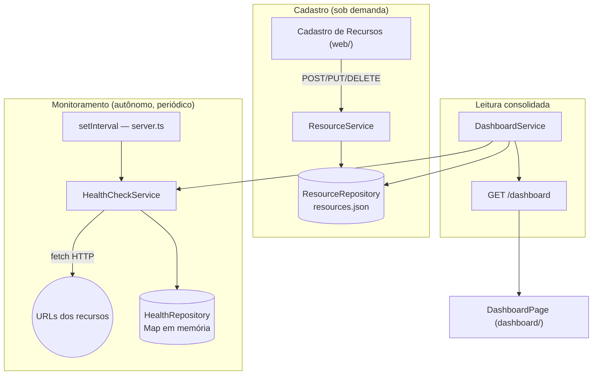
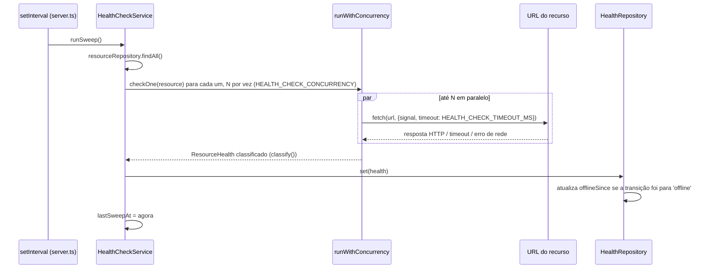
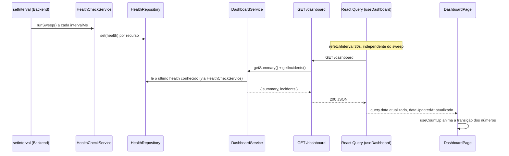

# Painel Operacional — Documentação Técnica

Documento único e completo do monitoramento operacional (Health Check + Dashboard). Consolida o que estava espalhado entre `api/README.md`, `web/README.md` e `dashboard/README.md`, evitando duplicação — os três READMEs referenciam este arquivo em vez de repetir o conteúdo.

> Este documento vive em `api/docs/` porque a lógica de monitoramento (agendamento, classificação de status, agregação) é implementada inteiramente no Backend. O consumo dessa informação pelo Frontend do Painel Operacional (`GET /dashboard`) está descrito na seção [Fluxo Backend → Frontend](#fluxo-backend--frontend). **Desde a separação do Painel Operacional em um projeto próprio, esse Frontend é o `dashboard/`** (projeto independente, fora do `web/`) — o `web/` continua sendo responsável só pelo Cadastro de Recursos (escrita).

---

## Sumário

- [Objetivo](#objetivo)
- [Arquitetura](#arquitetura)
- [Fluxo de monitoramento](#fluxo-de-monitoramento)
- [Estados do recurso e tabela de classificação](#estados-do-recurso-e-tabela-de-classificação)
- [Fluxo de atualização automática](#fluxo-de-atualização-automática)
- [Fluxo Backend → Frontend](#fluxo-backend--frontend)
- [Casos de uso](#casos-de-uso)
- [Cenários de teste](#cenários-de-teste)
- [Limitações conhecidas](#limitações-conhecidas)
- [Melhorias futuras](#melhorias-futuras)

---

## Objetivo

Dar à equipe de operações uma visão única e sempre atualizada da saúde de todos os recursos catalogados (APIs, Web Services, Sites), sem que ninguém precise checar cada serviço manualmente. O Backend varre as URLs cadastradas de forma autônoma e periódica; o Frontend só exibe o resultado já calculado — nenhuma checagem de saúde acontece no navegador.

## Arquitetura

Dois fluxos independentes que só se encontram na leitura:

`DashboardService` (`api/src/services/dashboard.service.ts`) não dispara nenhuma checagem própria — só lê o estado mais recente de `ResourceRepository` (catálogo) e `HealthCheckService` (saúde já calculada) e agrega os dois.

## Fluxo de monitoramento

O sweep é agendado em `api/src/server.ts` (disparo imediato no boot + `setInterval` a cada `HEALTH_CHECK_INTERVAL_MS`) e executado por `HealthCheckService.runSweep()` (`api/src/services/healthCheck.service.ts`):

Concorrência controlada por `runWithConcurrency` (`api/src/utils/promisePool.ts`) — um pool de workers próprio, sem dependência externa, que limita quantas requisições HTTP ficam em voo ao mesmo tempo.

## Estados do recurso e tabela de classificação

Existem **dois níveis** de status. O primeiro (`ResourceStatus`) é o resultado bruto do health check HTTP; o segundo (`DashboardResourceStatus`) é a visão consolidada que o Painel exibe, que também considera se o recurso foi desativado manualmente no cadastro.

### Nível 1 — Classificação HTTP (`HealthCheckService.classify`, `api/src/services/healthCheck.service.ts`)

| Condição observada | `ResourceStatus` |
|---|---|
| Recurso sem URL cadastrada | `unknown` |
| Timeout (`AbortController` após `HEALTH_CHECK_TIMEOUT_MS`) | `offline` |
| DNS não resolvido | `offline` |
| Conexão recusada | `offline` |
| Qualquer outra exceção de rede (`fetch` lança) | `offline` |
| HTTP ≥ 500 | `offline` |
| HTTP 2xx/3xx, dentro do prazo (`HEALTH_CHECK_SLOW_THRESHOLD_MS`) | `online` |
| HTTP 2xx/3xx, acima do prazo | `slow` |
| **HTTP 4xx (401, 403, 404, 429...)** | **`unknown`** |

> ⚠️ Ponto de atenção: um endpoint que responde HTTP 404 (rota removida, URL incorreta) é classificado como `unknown`, não `offline` — ver [Limitações conhecidas](#limitações-conhecidas). A regra foi implementada assim de propósito ("uma resposta 4xx não indica claramente que o recurso está fora do ar"), mas costuma ser confundida com o comportamento esperado de "serviço indisponível".

### Nível 2 — Status consolidado do Painel (`DashboardService.resolveStatus`, `api/src/services/dashboard.service.ts`)

| Condição | `DashboardResourceStatus` | Cor no Painel |
|---|---|---|
| `resource.active === false` | `maintenance` | 🟡 Em Manutenção — **prevalece sobre qualquer resultado de health check** |
| `active === true` e `ResourceStatus` é `online` ou `slow` | `online` | 🟢 Online (o Painel não distingue `slow` de `online`; o Catálogo, sim, via badge própria) |
| `active === true` e `ResourceStatus` é `offline` | `offline` | 🔴 Offline |
| `active === true` e `ResourceStatus` é `unknown` (ou sem entrada ainda) | `unknown` | ⚪ Desconhecido |

`active` é o campo controlado manualmente pelo operador em Cadastro de Recursos (toggle Ativo/Inativo) — é verificado **antes** de qualquer dado de health check, então desativar um recurso sempre resulta em "Em Manutenção", mesmo que ele esteja respondendo normalmente.

## Fluxo de atualização automática

| Camada | Intervalo | Definido em |
|---|---|---|
| Sweep de Health Check | `HEALTH_CHECK_INTERVAL_MS` — default do schema **30000ms**; `.env`/`.env.example` do repo definem **60000ms** (valor efetivo hoje) | `api/src/config/env.ts` + `api/.env` + `api/src/server.ts` |
| Polling do `/dashboard` (Frontend) | 30000ms fixo, com `refetchIntervalInBackground: true` | `dashboard/src/hooks/useDashboard.ts` |
| Polling de `/health/resources` (Catálogo) | 60000ms fixo | `web/src/features/catalog/hooks/useResourcesHealth.ts` |

**Inconsistência identificada**: o Frontend faz polling do Dashboard a cada 30s, mas o Backend só recalcula a cada 60s (valor real do `.env`) — metade das requisições de polling trazem exatamente o mesmo dado da anterior. Não causa erro, só desperdiça requisições; o ideal é os dois intervalos serem iguais ou o do Frontend ser múltiplo do Backend.

**O Dashboard pode ficar desatualizado?** Sim, em três situações (detalhadas em [Limitações conhecidas](#limitações-conhecidas)): janela normal de polling (até ~90s no pior caso), edição via Cadastro de Recursos sem invalidação da query `['dashboard']`, e recurso recém-criado aguardando o próximo sweep.

## Fluxo Backend → Frontend

Do agendamento no servidor até o número aparecer animado na tela:

Os dois pollers (sweep do Backend e `refetchInterval` do Frontend) rodam em ciclos independentes — o Frontend não sabe quando um sweep termina, só busca o estado mais recente disponível a cada 30s.

## Casos de uso

| Caso | Comportamento |
|---|---|
| Recurso ativo e saudável | 🟢 Online no Painel; badge "Online" no Catálogo |
| Recurso ativo e lento (acima do threshold) | 🟢 Online no Painel (agregado); badge "Lento" no Catálogo |
| Recurso ativo e fora do ar (timeout/5xx/DNS/conexão recusada) | 🔴 Offline; aparece em "Recursos que Exigem Atenção", com tempo offline calculado a partir de `offlineSince` |
| Recurso ativo respondendo 404 | ⚪ Desconhecido (não Offline — ver limitação) |
| Recurso desativado manualmente | 🟡 Em Manutenção, independente do health check |
| Recurso recém-criado | ⚪ Desconhecido até o próximo sweep completar |
| Recurso excluído | Desaparece do catálogo e do Painel na próxima leitura |

## Cenários de teste

| # | Cenário | Resultado esperado |
|---|---|---|
| 1 | Ativar recurso | Deixa de contar como "Em Manutenção" |
| 2 | Inativar recurso | Vira "Em Manutenção"; se o Dashboard já está aberto, só reflete no próximo poll (até 30s) |
| 3 | Cadastrar com URL inválida | Bloqueado no cadastro (Zod `.url()`), 400 `VALIDATION_ERROR` — nunca chega a ser persistido |
| 4 | Timeout | 🔴 Offline |
| 5 | DNS inexistente | 🔴 Offline |
| 6 | Conexão recusada | 🔴 Offline |
| 7 | HTTP 500 | 🔴 Offline |
| 8 | HTTP 404 | ⚪ Desconhecido |
| 9 | Recurso recém-criado | ⚪ Desconhecido até o próximo sweep |
| 10 | Exclusão de recurso | Some do catálogo e do Painel na próxima leitura |
| 11 | Reinício da API | `HealthRepository` zera; sweep inicial dispara antes do `listen`; recursos aparecem "Desconhecido" até o sweep completar |
| 12 | Reinício do Frontend (F5) | Cache do React Query zera; refetch completo; `isLoading` exibido até a primeira resposta |
| 13 | Dois sweeps sobrepostos (catálogo grande / timeout alto / intervalo curto) | Sem proteção estrutural hoje — ver limitações |

## Limitações conhecidas

Em ordem de impacto:

1. **HTTP 404 classificado como "Desconhecido", não "Offline"** (`healthCheck.service.ts`, `classify()`) — um endpoint removido ou com rota incorreta não é sinalizado como indisponível, podendo mascarar uma falha real durante o monitoramento contínuo.
2. **Mutações do Cadastro de Recursos não invalidam a query `['dashboard']`** (`web/src/features/admin/hooks/use{Create,Update,Delete}Resource.ts`) — só invalidam `['resources']` e `['summary']`. Um operador marcando um recurso como Inativo não vê o Painel refletir "Em Manutenção" imediatamente se já estava com a tela aberta; só no próximo poll (até 30s).
3. **Sem trava contra sweep sobreposto** (`healthCheck.service.ts`, `runSweep()`) — `setInterval` não aguarda a varredura anterior terminar. Com os parâmetros atuais (156 recursos, concorrência 20, timeout 5s, intervalo 60s) não há sobreposição na prática, mas nada no código impede que ocorra se esses parâmetros mudarem; se ocorrer, o resultado de uma varredura mais antiga pode sobrescrever um mais recente.
4. **Descompasso de intervalos** — Frontend faz poll a cada 30s, Backend só recalcula a cada 60s (`.env` atual).
5. **Estado de saúde só em memória** (`HealthRepository`) — perdido a cada restart do processo, repovoado em um sweep completo (até ~40s no pior caso com os parâmetros atuais).
6. **`slow` não é distinguível no Painel** — `resolveStatus()` funde `online` e `slow` num único estado; a distinção só existe no Catálogo.

## Melhorias futuras

> Não implementado — direção sugerida, não funcionalidade existente.

- Reclassificar HTTP 4xx (ao menos 404) como sinal de indisponibilidade, ou introduzir um status próprio para "resposta inesperada do servidor".
- Incluir `['dashboard']` e `['health', 'resources']` na invalidação de cache das mutações do Cadastro de Recursos, eliminando a janela de defasagem após uma edição manual.
- Adicionar uma trava (`isRunning`) em `HealthCheckService.runSweep()` para impedir sobreposição de varreduras.
- Igualar o intervalo de polling do Frontend ao intervalo real de sweep do Backend (ou tornar um múltiplo do outro).
- Persistir o último resultado de health check (ainda que de forma simples) para sobreviver a um restart sem a janela de "Desconhecido" generalizado.
- Expor `slow` como um estado visível e distinto no Painel Operacional, não só no Catálogo.
